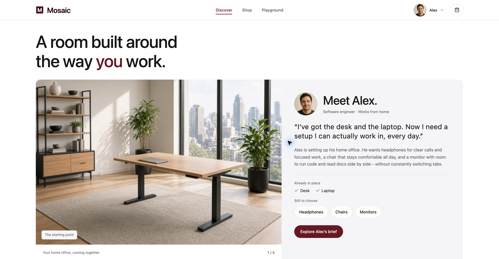
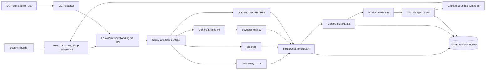

# Build agentic hybrid retrieval with Amazon Aurora PostgreSQL

[](https://github.com/aws-samples/sample-agentic-hybrid-retrieval-aurora-postgresql/actions/workflows/ci.yml)
[](https://github.com/aws-samples/sample-agentic-hybrid-retrieval-aurora-postgresql/actions/workflows/github-code-scanning/codeql)
[](https://github.com/aws-samples/sample-agentic-hybrid-retrieval-aurora-postgresql/actions/workflows/github-code-quality/codeql)
[](https://www.python.org/)
[](https://nodejs.org/)
[](https://www.postgresql.org/)
[](https://react.dev/)
[](LICENSE)

The session thesis is simple: **retrieval correctness is a pipeline property,
not a top-1 result**.

A search can return a plausible top result while the system behind it is
wrong. In this session you repair three failures that hide behind healthy
components: a missing candidate path, broken fusion masked by reranking, and
evidence that reaches an agent but cannot safely support its answer.

Mosaic is a production-shaped product discovery application that pairs
PostgreSQL full-text search, `pg_trgm`, pgvector HNSW, reciprocal-rank fusion,
and Cohere Rerank through Amazon Bedrock with a React storefront, a typed FastAPI
service, a Strands agent, and an optional MCP adapter. The workshop searches
500,000 imported Amazon Reviews 2023 products with saved Cohere Embed v4 vectors;
the historical synthetic catalog is retained separately. The complete session
framing is in [the session abstract](docs/session-abstract.md).



> [!IMPORTANT]
> **Aurora only.** This project has no local database path. Every database
> command must receive a `DATABASE_URL` for the intended Aurora PostgreSQL
> cluster. See [ARTIFACTS.md](ARTIFACTS.md) before running any `db-*`, lab,
> evaluation, or API target.

**Jump to:** [Quick start](#quick-start) | [Architecture](#architecture) |
[Workshop path](#workshop-path) | [Validation](#validation) |
[Take hybrid agentic search into your own agent](#take-hybrid-agentic-search-into-your-own-agent) |
[Repository map](#repository-map)

## Quick start

**Workshop Studio participants:** Code Editor opens [Start Here](START_HERE.md)
as a rendered preview with a ready terminal. Follow the workshop guide; the
application and Aurora database are already running. The Explorer keeps Mosaic's
source and `AGENTS.md`, `VOICE.md` and `CLAUDE.md` visible, while hiding generated
files and instructor answer sheets. Keep observations in `learning-notes.md`.

For your own application environment, use these prerequisites:

- Python `3.13` and [`uv`](https://docs.astral.sh/uv/);
- Node.js `22` and npm, matching the workshop host, which installs the
  versioned `nodejs22 nodejs22-npm` pair and asserts `v22`
  in [`deploy/mosaic-bootstrap.sh`](deploy/mosaic-bootstrap.sh);
- PostgreSQL client tools;
- AWS credentials for Amazon Bedrock in `us-east-1`;
- an Aurora PostgreSQL `DATABASE_URL` for the Mosaic catalog.

Install the locked dependencies and create the runtime environment:

```bash
make setup
make ui-install
cp config/.env.example .env
```

`ui/package-lock.json` stays at lockfile version 3, which the Node 22 bundled
npm 10 reads. Regenerate it with `npx npm@12 install --package-lock-only`
from `ui/` (npm 10's resolver crashes on lock changes) and then run `npm ci`.

Edit `.env`, then start the API:

```bash
set -a
source .env
set +a
make api-serve
```

Start the React application in a second terminal:

```bash
make ui-dev
```

Open `http://127.0.0.1:5173`. The API defaults to
`http://127.0.0.1:8000`. Override `UI_PORT`, `API_PORT`, or
`CATALOG_API_PROXY` when those ports are occupied.

For example, run the API with `make api-serve API_PORT=8014`, then run
`make ui-dev UI_PORT=5174 API_PORT=8014` in the second terminal. The UI proxy
follows `API_PORT`; an explicit `CATALOG_API_PROXY` takes precedence.

Useful runtime probes:

```bash
curl http://127.0.0.1:8000/api/health
curl http://127.0.0.1:8000/api/readiness
```

`/api/readiness` validates the live schema, product and embedding counts,
premium cohort, evidence coverage, required retrieval indexes and functions,
model-space compatibility, and AWS credential availability.

If `DATABASE_URL` contains `&`, keep it single-quoted when sourcing the file.
Corporate-network TLS and security-group diagnostics are documented in
[ARTIFACTS.md](ARTIFACTS.md).

## What Mosaic demonstrates

| Capability | Implementation | Inspectable proof |
|---|---|---|
| Exact and lexical retrieval | PostgreSQL weighted FTS with strict-query preservation | FTS rank, source URI, and persisted retrieval event |
| Typo recovery | `pg_trgm` candidate generation | Trigram similarity and rank contribution |
| Semantic retrieval | Cohere Embed v4 with pgvector HNSW | Vector distance, HNSW settings, and model identity |
| Product eligibility | SQL columns and JSONB predicates applied before fusion | Applied filters and production `matches_filters` checks |
| Candidate fusion | Unweighted reciprocal-rank fusion | Per-arm ranks, contributions, and pre-rerank order |
| Final ordering | Cohere Rerank 3.5 through Amazon Bedrock | Rerank score, final rank, and exact-identity preservation |
| Grounded recommendations | Strands tools over product and evidence records | Tool trace, retrieval IDs, evidence IDs, and numbered citations |
| Production diagnosis | Persisted events and on-demand `EXPLAIN (ANALYZE, BUFFERS, SETTINGS, FORMAT JSON)` | Query plan, indexes, runtime settings, and Aurora identity |

The visible application surfaces are three, and each is reachable at the name
the navigation prints for it (`/discover`, `/shop`, `/playground`) as well as at
its canonical path (`/`, `/catalog`, `/labs/retrieval`), which is what workshop
instructions deep-link to:

- **Discover** - Alex's home-office brief, an illustrated workspace walkthrough,
  and search links for headphones, chairs and monitors. Alex is fictional;
  product search uses the selected imported catalog;
- **Shop** - hybrid search, filters, sorting, product detail, and Ask Mosaic.
  Browse links preserve product attributes and brand constraints through the API.
  Select two to five results and compare them side by side; the
  comparison is served by `POST /api/retrieval/events/{id}/compare`, which
  retrieves nothing and reads that run's persisted receipt, so it shows which
  arms found each product and how reranking moved it. The tick boxes appear
  only once a search has run, because a retrieval's grant is what authorises
  a comparison. A search whose words the catalog does not carry says so above
  the results;
- **Playground** - Retrieve, Rank, and Reason appear side by side on laptop and
  desktop screens, with aligned summaries, compact product cards, notes and
  inspection controls. Follow matching products and changes in rank across
  the columns. Reason groups every recommendation together; **Read Mosaic’s
  full answer** expands the complete explanation. Search details and sources
  remain available within each column. Narrow screens stack the stages.
  Each column ends with a **Keep in mind** line naming the lesson it proves,
  the same line the opening slides carry.
  Retrieve and Rank follow the same preview products before and after reranking.
  The story asks three questions: which eligible products can we find, how should
  we order them, and what choice can the sources support? Method comparisons
  remain available under **Compare search methods**. Proof is part of each lab,
  with an unnumbered **Prove** section in the guided view.
  Each recommendation links to the search that returned it, including when the
  agent uses more than one search. All three columns use the full product title,
  and photos stay consistent with Shop. Shop links open the saved search; **Start a new run** searches
  again, with a way back to the saved Shop results.
  Clearer calls is the starting request. Plan my workspace demonstrates separate
  searches for two product needs; Check the sources compares specification and
  sample review records read by the agent. Coding exercises and adaptation guides
  live in the workshop and take-home documentation.
  Lab 3 asks the agent to check the Dell U2720Q monitor and the Steelcase
  Gesture chair against their sources, using fresh searches with memory off. The [presenter brief](workshop.md) carries the opening,
  transitions and final claim-to-source walkthrough.
  The opening explains the provided scaffolding and the three connections
  participants implement. In **Answer and sources**, the recorded activity
  distinguishes steps requested by the model from steps started by application
  code, including when the origin was not recorded. The stage explanations
  separate eligibility from vector-search coverage, and ranking correctness
  from the measured benefit of reranking.
  Ask Mosaic's **Recorded steps** uses the same origin labels and shows whether
  each step completed, failed or was declined.
  **View retrieval event** reads the saved search context and ranks from Aurora;
  candidate eligibility is checked against the current catalog. **Run EXPLAIN
  ANALYZE** executes the search SQL again and saves a new plan. Its summary shows
  reported rows, loops, times, buffers and visible index names without guessing
  what happened inside a Function Scan. Recorded search timings distinguish the
  database round trip from the complete search request and new plan execution.
  Answer checks also keep battery life and recommended use separate: the same
  number of hours in one field cannot support a claim about the other.
  The participant guide in the companion Workshop Studio repository follows
  the [L400 lab design](docs/l400-lab-design.md):
  every lab page has the same shape and four numbered tasks (observe,
  diagnose, repair, prove). The monitor-and-chair Lab 3 contract is settled;
  the terminal runs the before and after requests and Shop shows the same
  question as a separate, optional run.
  **Session & Memory** explores AgentCore conversation events, semantic facts,
  user preferences, session summaries and episodic memory. Inspect the connected
  strategies and extracted records, then recall relevant context in a new
  session. Aurora still supplies product evidence. See [setup and behavior](docs/session-memory.md).
  **Scale & HNSW** starts with saved Off / Strict / Relaxed scan comparisons and
  full precision, halfvec and binary measurements. Current index details are
  separate from dated benchmarks. Detailed SQL and the interactive 3D graph
  illustration are available on demand; the graph runs only while expanded.

The storefront is designed for laptop browser viewports at normal zoom. Page
navigation keeps the header in place and restores scroll and keyboard focus.
Opening Ask Mosaic preserves space around the catalog, and long search questions
wrap in full. The panel keeps its title and follow-up box visible while the
conversation scrolls; waiting and completed steps use compact rows.
**Use saved memories** optionally connects Ask Mosaic to the same AgentCore
Memory resource as the Playground. It starts off. With it enabled, each answer's
**Memories used** section shows the records read and whether the conversation was
saved. **Clear chat** starts a new conversation while keeping saved preferences.
Ordinary follow-ups work with memory off; the required labs keep it off.
The app explains each step in ordinary language: search details, sources used,
saved results, and comparisons between methods. Expanded details retain the SQL,
ranking formula, settings, API records, and measurement limits needed to build
and diagnose the system. [Participant language](VOICE.md) defines this standard.
Ask Mosaic shows retrieval progress before bringing the cited answer forward
and folding the activity into **Steps and sources**.
Before writing an answer, a separate model review checks the current request
against every selected product and its fresh evidence. Prior turns resolve
references; they do not authorize a product pitch after the topic changes.
The review submits one typed decision through Bedrock tool use. The service
validates its fields, product ownership and source IDs before writing; prose,
missing or duplicate decisions, and interrupted responses cannot authorize an answer.
A field-format failure permits one fresh review of the same inputs. Both calls'
token use is counted; a second invalid response stops the answer.
Lab checks follow each mission's declared requirements. The main Lab 3 request
requires independent monitor and chair searches, a compared shortlist, and
citations that resolve exactly to each product's own records.
Questions about specs and reviews explain the available source facts and any
missing review excerpts. A rating or review count cannot establish what reviewers
said. Missing review text is not reported as a missing product.
Unsupported requests and unproven device compatibility receive a clear decline
with no recommendation cards. Citation and numeric checks still validate the
answer after writing. The semantic review is an additional model judgment,
not a proof of every possible natural-language claim; its decision and usage
are retained with the turn.

For Lab 1, compare the saved-ID transposition `B07G95T3JP`, the correct ID
`B07G95TJ3P`, and the independent descriptive search under their declared filters. **Pin as baseline** in the retrieval lab preserves
the saved before result across reloads; compare it with the repeated request
after repair. Candidate counts overlap, so they do not measure unique additions.

The required labs follow Alex's unfinished home office: find his saved headphones,
keep a suitable monitor in the shortlist, then justify the monitor and wheeled
chair and revisit the headphones' review evidence. Each guide starts with a
scenario and architecture, then asks for a prediction, a bounded repair and an
independent challenge. Builders use `psql` in the Code Terminal to inspect
installed search functions, query plans, saved rankings and source records.
`scripts/lab_terminal.py` runs the real application request and prepares its exact
IDs and parameters; Lab 3 also runs the agent and challenges its citation checks. See
[the L400 teaching contract](docs/l400-lab-design.md) for scope and proof limits. The Lab 3 source check runs the edited registration
function against repeated and later evidence calls; valid local names and moving
the product-list lookup outside the loop do not require matching the reference
answer's structure. Production checks still validate the complete answer path.
Saved tool calls retain their execution sequence, so completion replay grades
the final successful synthesis after a rejected draft. Failed attempts do not
inherit the final answer's citations.

Shop's **Explore** examples group keywords, a mistyped listing ID and natural
requests. They resolve the existing queries and filters from the mission
manifest; the labels describe ways to ask, not separate search modes.
After a search, **Shop + search details** keeps the product cards beside their
source positions, combined RRF positions and final positions. Switching order
inspects the same saved request without calling retrieval again. The panel
identifies the displayed subset and links to the full search in Playground.
Saved searches open in Playground's three-column pipeline overview, including
links carrying a lab example. **Open lab details** keeps that search available
in the detailed workbench. Explicit guide and agent-proof links still open their
lab controls.
Workshop provisioning still installs the three declared faults. The local
working environment can remain repaired; view controls never change lab state.

<details>
<summary>See Shop and Playground</summary>


</details>

Search and agent results always come from the API. The UI does not recreate
retrieval scores or silently substitute fixture products when Aurora, Bedrock,
reranking, evidence, or synthesis is unavailable.
If a catalog connection times out, the app reports the wait and asks the
facilitator to check Aurora connectivity and database capacity. A timeout alone
does not establish that the connection pool is full.
When a Playground run stops, its active stage says **Stopped** and later stages
say **Not reached**. Available search records remain inspectable; **Try again**
starts a new run. In Shop, submitting the same question starts a fresh search.

## Architecture



Aurora is both the search engine and the context system: canonical product
metadata, FTS documents, trigram-normalized text, structured attributes,
embeddings, HNSW indexes, evidence, retrieval events, judgments, and benchmark
records remain in one transactionally consistent data plane.
Search, model invocation, and synthesis span multiple transactions; persisted
receipts connect those stages.

See [the architecture reference](docs/architecture.md) and
[the API contract](docs/api-contract.md) for the complete runtime boundaries.

## Workshop path

The 60-minute session reserves 10 minutes for an Introduction / Overview /
Presentation, 40 minutes for the three labs (including their proofs and the
completion gate), and 10 minutes for optional work or recovery:

```text
RETRIEVE -> RANK -> REASON
```

| Lab | Time | Participant outcome |
|---|---:|---|
| **1. Build hybrid retrieval** | 10 min | Show from `tsvector` lexemes and `pg_trgm` word similarity why only close spelling recovers a transposed listing ID, reconnect it from its contract, then write a recall query graded under the planner's exact plan and forced HNSW, which in recorded runs was roughly 6–7× faster yet missed half or more of the true neighbours. *A full list is not evidence of good recall.* |
| **2. Fuse, rerank, and inspect** | 10 min | Write RRF in SQL (graded at five `k` values), find that collapsed contributions left two distinct scores so a `product_id` tie-breaker picked the reranking shortlist, repair production to match, then propose one setting change under a rule stated in advance, judged on 141 ESCI queries. *Fusion only works if positions count; tuning needs a judged set.* |
| **3. Build the retrieval agent** | 20 min | Specify the evidence contract as tests that reject four faulty variants, repair the handoff, check each citation's product, revision and quote, separate cited evidence from available evidence, and prove from the agent's saved searches that the Lab 1 and Lab 2 repairs reached the answer. *Finding, citing and supporting are three separate checks.* |

Each lab removes one failure from the same final answer for Alex, and asks
more than the one before: explain a mechanism, write an algorithm, then specify
a contract as tests. Each lab's graded work is the participant's own, checked
by `uv run python scripts/lab_exercise.py check --lab N` against independently
computed answers (Lab 1 `.local/lab-1/recall.sql`; Lab 2 `.local/lab-2/rrf.sql`
and `.local/lab-2/proposal.json`; Lab 3 `labs/lab3/test_evidence_contract.py` and
`.local/lab-3/claims.sql`). The grader never prints a reference answer, the
guides no longer print the reference repairs, and every graded attempt is saved
in `mosaic.lab_decision` for the finale, **Bring Alex's office home**, to read
back. The optional Scale & HNSW exercise is graded by
`scripts/flex_exercise.py`: a partial HNSW index (full precision, `halfvec` or
binary quantization) built twice in a rolled-back transaction.

The checked-in source is the solved reference implementation. Deliberate
starter states are injected by `scripts/lab_state.py`; a failure already present
in the repository is a defect, not an exercise. The single source for lab
timings, queries, targets, assertions, and checkpoints is
[`data/evals/mosaic_labs_missions.json`](data/evals/mosaic_labs_missions.json).

In Playground, **Code repaired** describes the exercise file and **SQL repair
applied** describes the installed Aurora function. Completion proof separately
checks the recorded behavior. Starting a new run clears the previous run's
proof. Both the browser and CLI run the mission's required supporting controls;
Reason also requires independent target searches and a retrieval explanation.

Build your own filtered tool with [the hands-on extension](docs/build-retrieval-tool.md),
then follow [the implementation map](docs/use-in-your-app.md) to adapt the schema,
ranking SQL and evidence boundary.

Read [the curriculum](docs/retrieval-curriculum.md) and
[the intentional-gap contract](docs/intentional-gaps.md) before changing a lab
seam.

The companion Workshop Studio project owns participant instructions,
provisioning-time gap injection, deployment automation, and the clean-account
rehearsal. Repository checks prove the source contract; they do not replace
fresh-stack deployment and projector rehearsal.

The current worked examples use the imported `reviews-2023-500k-v1` catalog:
Bose listing-ID recovery, Dell 4K/90W monitor ranking, and a monitor/chair answer
checked against sources. [The example library](docs/real-catalog-exercise-library.md)
records alternative requests and both their successful and unsuccessful outcomes.

## Workshop catalog delivery

The served catalog is `reviews-2023-500k-v1`: 500,000 source product records
from Amazon Reviews 2023 with verified, saved Cohere Embed v4 vectors. Bootstrap
downloads the pinned `real-catalog/real-catalog.tar.gz.part-*` files (Workshop Studio caps
asset objects at 1 GB), checks each part, joins and verifies the archive before database loading,
restores the records and vectors, and selects that dataset for the app and labs.
The bundle also contains 2,327 source-verified review excerpts covering 476
products: every product in the saved candidate pools of the lab requests, their
controls and the Lab 3 agent's searches (`data/lab-review-parents.json`), plus the
earlier preview samples. `scripts/fetch_catalog_reviews.py` scanned both review
files end to end and kept up to three of the most helpful reviews per rating group
(positive, mixed, critical) for each product. That is a selection, not a
representative sample; each product's source rating count stays available beside
it. Alex's picks are thinly reviewed in the source itself: the Dell U2720Q listing
has 6 ratings and 2 excerpts, the Steelcase Gesture listing 1 and 1.

[`db/config/real-catalog-cache.json`](db/config/real-catalog-cache.json) pins the
bundle hash and size. `scripts/real_catalog_cache.py` verifies record hashes,
embedding input hashes, model identity and saved-vector integrity. Loading does
not generate new embeddings. The original cached bootstrap remains a base for
shared tables and historical optional benchmarks, so the database retains both
catalogs; Shop and the required labs serve only the selected real catalog.

The bundle is prepared locally and excluded from Git. Public redistribution
clearance remains unresolved in the [source assessment](docs/catalog-source-assessment.md).
Source publication, asset publication, broad catalog-quality measurement and a
fresh-account rehearsal are separate gates.

## Release baseline

**Historical baseline:** the measurements below describe the earlier synthetic
catalog. They are retained for traceability and do not certify the imported
catalog. Current lab proof, representative evaluation, Workshop Studio asset
publication and fresh-account rehearsal are separate gates.

The Aurora release contract verifies:

| Property | Baseline |
|---|---:|
| Aurora PostgreSQL | 18.x |
| pgvector | 0.8+ |
| Products | 500,000 |
| Product embeddings | 500,000 |
| Embedding model | `us.cohere.embed-v4:0` |
| Embedding dimensions | 1,024 |
| Rerank model | `cohere.rerank-v3-5:0` |
| Agent and synthesis model | `global.anthropic.claude-sonnet-5` |
| Code Editor coding coach | Claude Code 2.1.233, `global.anthropic.claude-sonnet-5` through Bedrock |
| Premium visual cohort | 120 products |
| Photographed Shop edit | 200 products |
| Product specification coverage | 500,000 products |
| Generated review evidence | 15,000 records |
| Filter-contract cases | 720 |
| Canonical scorecard | 20 product retrieval cases plus 1 agent contract case |

This historical catalog is synthetic and represents no real products, reviews,
or customer testimony. It spans three domains:

| Domain | Products | Retrieval emphasis |
|---|---:|---|
| Consumer electronics | 210,000 | model and SKU precision, compatibility, specifications, lexical ambiguity |
| Running and fitness | 160,000 | semantic intent, nuanced attributes, hard negatives |
| Home office and workspace | 130,000 | ergonomic intent, dimensions, compatibility, selective filters |

The three compressed catalog shards are checked into `data/full/`; their load
order, size limits, and SHA-256 digests are enforced by the dataset contract.
Real Cohere embeddings are not stored in Git. Workshop Studio restores them
from a pinned, content-addressed cache into a fresh encrypted Aurora cluster.
Hash embeddings require explicit development opt-in and cannot support workshop
relevance claims.

## Validation

### Offline contracts

These checks do not make Aurora or Bedrock readiness claims:

```bash
make setup
make lint
make validate
make validate-db
make validate-config
make validate-release-workflow
uv run python scripts/mission_contract.py --shape-only
PYTHONPATH=. uv run pytest -q

make mcp-install
make mcp-test
make mcp-wheel-smoke

make ui-install
make ui-test
make ui-build
make ui-audit
```

### Aurora-backed release gates

With `DATABASE_URL` pointing at the intended Aurora cluster:

The full Python gate includes 15 integration tests against Aurora (read-only queries and a rolled-back retry transaction).

```bash
MISSION_GATE_REQUIRE_DB=1 make validate-missions
make validate-evals
FUNCTION_CENSUS_REQUIRE_DB=1 make validate-functions
make db-verify-bootstrap
make test
make test-aurora-invariants
make score-evals
```

`make validate-evals` proves the 720 target/filter contracts through the
production `mosaic_search.matches_filters` function. `make score-evals` runs
the served retrieval path over the canonical scorecard and verifies source,
dataset, retrieval settings, model, Aurora version, ranked results, and measurement details.
It is a release gate, not a general benchmark command. After any change to a
file in the retrieval fingerprint, Prove reports the scorecard as pending and
two scorecard tests go red until both measurements run again, in order and
each from a clean commit with `AURORA_INSTANCE_CLASS` exported: `make
score-evals SCORE_EVAL_ARGS="--restart --write-baseline"`, commit the two
scorecard artifacts, then `make ablation-evals` and commit the search-method comparison
artifact. The sequence is spelled out in
[`docs/evaluation-plan.md`](docs/evaluation-plan.md).

These assets answer different questions:

- lab regression checks ask whether critical behavior regressed;
- the 20 product-retrieval cases measure retrieval quality;
- the 720 generated fixtures test whether filters violated their contract.

The [current scale benchmarks](docs/current-scale-benchmarks.md) cover all 30
anchor products across the current 500,000-vector Aurora catalog, with exact
top-10 comparisons and warm database p50/p95 timings. The report includes the
rerun command and raw samples. `scripts/benchmark_mosaic_scale.py` refreshes the
current artifact; `scripts/benchmark_hnsw.py` is the older sweep-only runner.
`scripts/simulate_scale.py` produces a labeled projection and must not be
presented as benchmark evidence.

See [READINESS.md](READINESS.md) and
[the evaluation plan](docs/evaluation-plan.md) before accepting or publishing a
new scorecard.

## Continuous integration and security

[`Project CI`](.github/workflows/ci.yml) runs the offline Python, configuration,
schema-package, MCP, UI, build, and dependency-audit gates on pull requests and
pushes to `main`.

Release checks run on a networked self-hosted runner labeled `mosaic-aurora`:

| Job | Trigger | Required configuration |
|---|---|---|
| Non-billed Aurora release contracts | A `v*` tag or manual workflow dispatch, after offline checks | `MOSAIC_AURORA_DATABASE_URL` and the `MOSAIC_WORKSHOP_REPO` repository variable |
| Billed model-backed Aurora invariants | After the non-billed job, on those same release triggers | Approval through `mosaic-aurora-billed`, plus `MOSAIC_AURORA_CI_ROLE_ARN` and OIDC access in `us-east-1` |
| Billed canonical scorecard | Manual dispatch with `run_billed_scorecard=true`, after both preceding jobs | The same approved environment, database, AWS role, and OIDC access |

The non-billed job checks the published Studio pin and bootstrap, live missions,
filter contracts, function census, bootstrap acceptance, and SQL integration.
Model invocations are confined to the billed jobs. A green source CI badge
does not certify a fresh Workshop Studio deployment or a new scorecard.

GitHub CodeQL default setup scans Python and JavaScript/TypeScript; Code Quality
runs as a separate GitHub workflow. Actions are
pinned to full commit SHAs, workflow permissions are minimal, and dependency
auditing is part of the UI gate.

### Publish source and repin Workshop Studio

Commit and push the validated application changes before repinning. From the
companion Workshop Studio checkout, run:

```bash
uv run --no-project --with PyYAML==6.0.3 python scripts/repin.py \
  --source-repo ../sample-agentic-hybrid-retrieval-aurora-postgresql
uv run --no-project --with PyYAML==6.0.3 python scripts/repin.py --check \
  --source-repo ../sample-agentic-hybrid-retrieval-aurora-postgresql
```

The repin requires a clean source checkout at published `origin/main`. It
updates every source-revision consumer, the bootstrap hash, and the derived
infrastructure revision together. The event owner then publishes the Studio
assets to S3, verifies the delivered bootstrap, validates the Studio checkout,
and commits and pushes that repository. The complete procedure belongs to its
`FACILITATOR_GUIDE.md`.

## Aurora bootstrap and recovery

The portable Workshop Studio path imports the checked-in catalog and a verified
embedding cache:

```bash
make db-bootstrap-base DATABASE_URL="$DATABASE_URL"
uv run python scripts/real_catalog_cache.py join \
  --archive build/real-catalog-cache/real-catalog.tar.gz
uv run python scripts/real_catalog_cache.py restore \
  --archive build/real-catalog-cache/real-catalog.tar.gz \
  --selection build/real-catalog
```

The base bootstrap loads the historical synthetic rows and shared tables without
vectors; Workshop Studio's 3 GB total asset cap cannot hold both vector sets, and
the labs serve only the real catalog. The historical synthetic embedding cache
(`make db-fetch-embeddings`, `scripts/embedding_cache.py`) remains available for
local historical work but is not part of the workshop deployment. The historical
cache contains resumable float32 NPZ shards and a SHA-256 manifest.
Changed, missing, or model-incompatible products fail import instead of silently
receiving stale vectors. A cluster snapshot remains the fast same-account
operator recovery path; the cache is the portable cross-account path.

The supplied infrastructure is intentionally workshop-shaped. A production
deployment must choose its own high-availability, backup, deletion-protection,
authentication, connection-pooling, monitoring, and retention policies.

The complete restore policy and the non-recoverable predecessor history are in
[ARTIFACTS.md](ARTIFACTS.md).

## Optional MCP contract

MCP interoperability is supported reference material rather than a fourth
required lab. The isolated MCP environment (specification revision
`2026-07-28`, `mcp` SDK 2.0) exposes three typed,
catalog-read-only product search, product evidence, and retrieval-run inspection
tools over the same API:

```bash
make mcp-install
make mcp-test
make mcp-serve
```

Search still appends retrieval and candidate receipts, so it is intentionally
non-idempotent and requires write capacity for observability data. It never
mutates catalog or business records.

Connect a compatible host to `http://127.0.0.1:8001/mcp`. The agent and MCP
surfaces are projections of
[`db/config/agent_tool_contracts.json`](db/config/agent_tool_contracts.json);
they do not maintain independent retrieval schemas.

See [the MCP interoperability guide](docs/mcp-interoperability.md).

## Optional telemetry export

Aurora stores the canonical Retrieve → Rank → Reason evidence ledger. Mosaic
also defines an optional, aggregate-only OpenTelemetry projection for agents
observed through Amazon Bedrock AgentCore without moving the current runtime or
deploying AgentCore resources in Workshop Studio. Prompt/answer capture and the
AWS exporter are both opt-in.

Aurora stays the ledger and the projection stays aggregate: stage timings,
candidate counts, rerank and completion status, model and token metadata, and
correlation identifiers, with no product identity or evidence text.
`service/telemetry.py` and `service/telemetry_contract.py` emit nothing until an
operator installs the exporter with `uv sync --extra agentcore-observability` and
sets `MOSAIC_AGENTCORE_OBSERVABILITY=true`. The repository ships the AWS Distro
for OpenTelemetry path; the application configures no exporter of its own, so
where spans go is an operator choice. No AgentCore resource sits in the required workshop
path, and no lab reads a span.

See [the portable telemetry contract](docs/telemetry-contract.md).

The optional [AgentCore Runtime container](docs/agentcore-runtime.md) packages
the same service. Its smoke check validates AgentCore health and Mosaic identity
and removes only its own container. Managed hosts can set
`MOSAIC_DATABASE_SECRET_ARN` to load the Aurora DSN from Secrets Manager at
startup, keeping the password out of Runtime environment settings.

The [Strands Harness evaluation](docs/strands-harness-evaluation.md) covers both
the retrieval agent and a scoped coding assistant, including model selection
and the limits of the trial. The shipped runtime remains on its validated SDK.

## Take hybrid agentic search into your own agent

Carry forward **tsvector + pg_trgm + pgvector → RRF → Cohere Rerank →
evidence-backed answers**, with separate checks for filters, recall, ranking
and citations. The skill works with any agent that can read its instructions
and call a compatible backend. Your host application orchestrates the four
retrieval operations and validates citations, or calls Mosaic’s complete
answer endpoint. Adapt the implementation to your own entities and evaluation questions.

| Take home | Where it lives | What it proves |
|---|---|---|
| **The SQL.** Three candidate arms with eligibility applied inside each, unweighted reciprocal rank fusion over rank positions, and a bounded pool handed to the reranker. | [`db/sql/09_search_functions.sql`](db/sql/09_search_functions.sql), tuned only by [`db/config/retrieval.yaml`](db/config/retrieval.yaml) | Labs 1 and 2: a healthy arm can be disconnected from fusion, and fusion arithmetic can be wrong while the page looks right. |
| **The eval.** Twenty graded searches scored on Recall@10, MRR and nDCG@10, and a comparison that scores each search method alone, all three combined, and combined then reranked. | [`scripts/score_evals.py`](scripts/score_evals.py), [`scripts/ablation_evals.py`](scripts/ablation_evals.py), [`data/evals/`](data/evals/) | Prove, and **Compare search methods** in the Playground's Retrieve column. Copy the evaluation runner and replace the query set. |
| **The guard.** Retrieved evidence is registered and authorized by the application before synthesis may cite it, and the claim checks reject what the evidence cannot support. | [`service/agent_tools.py`](service/agent_tools.py), [`service/synthesis.py`](service/synthesis.py) | Lab 3: the model requests tools; the application decides what runs and what is citable. |
| **The skill.** The search-to-answer workflow, four retrieval operations and quality checks. | [`skills/mosaic-hybrid-retrieval/`](skills/mosaic-hybrid-retrieval/) | A portable declaration and operating guide, not a standalone retrieval runtime: callers still need a deployed service implementing the contract. |

Start with [Adapt the implementation](docs/use-in-your-app.md), the map into the
SQL, evaluation runner and citation checks. The app's `/api/builder-package`
download includes that guide, reference SQL and an optional tool exercise; keep
the full checkout for runnable code and dependencies.

**Download the skill** from `/api/skill-package` when connecting a calling agent
to a running Mosaic service. Keep the folder together: `SKILL.md` declares the four-operation HTTP
skill surface, and its references provide the generated argument-to-HTTP map,
filter/recall/ranking/citation checks, the exact HTTP/MCP/A2A deployment status,
and an adaptation checklist. Extract it into your agent’s skill directory, or
load `SKILL.md` and its references as instructions in another tool-capable host.
Supply the backend URL and authentication through that host’s configuration.
The workshop endpoint expires with the event; the download does not include a
database, credentials or a hosted service. The
optional build-a-tool exercise is additional practice in the Workshop Studio
guide.

The reusable teachings are the architecture's invariants: apply hard eligibility
before candidate limits, bound every retrieval stage, fuse before reranking,
persist replayable receipts, separate served results from downstream grants,
and keep source attribution attached to evidence. Adopters must replace
Mosaic-specific schema, taxonomy, language configuration, embedding dimensions,
models, tuning, identity, retention, and evaluation data rather than copying
them as defaults.

Validate the package and its live FastAPI bindings with:

```bash
uv run python scripts/tool_contracts.py --check
```

Read [the calling instructions](skills/mosaic-hybrid-retrieval/SKILL.md) and
[the adaptation checklist](skills/mosaic-hybrid-retrieval/references/adapting.md)
alongside the implementation when mapping it to another domain.

## Sources of truth

Do not duplicate these contracts:

| Contract | Source |
|---|---|
| Candidate limits, fusion `k`, weights, trigram threshold | [`db/config/retrieval.yaml`](db/config/retrieval.yaml) |
| Lab queries, checkpoints, timings, targets, assertions | [`data/evals/mosaic_labs_missions.json`](data/evals/mosaic_labs_missions.json) |
| Assertion vocabulary and falsifiers | [`service/assertions.py`](service/assertions.py) |
| Agent, MCP, and skill tool schemas | [`db/config/agent_tool_contracts.json`](db/config/agent_tool_contracts.json) |
| Dataset load order and domain counts | [`data/full/manifest.json`](data/full/manifest.json) |
| Product-bound media contract | [`data/media/asset_labels_200.json`](data/media/asset_labels_200.json) |

Repository gates reject duplicate retrieval constants, configuration drift,
missing falsifiers, malformed mission contracts, stale SQL defaults, and
multiple live signatures for retrieval functions.

## Repository map

```text
config/       Runtime configuration and environment example
data/         Catalog shards, dictionaries, evaluations, and media manifests
db/           Aurora schemas, loaders, indexes, retrieval functions, and labs
deploy/       Source-owned Code Editor bootstrap and delivery contract
docs/         Architecture, curriculum, evaluation, operations, and UI contracts
mcp-server/   Isolated MCP adapter
scripts/      Data, embedding, validation, scorecard, and benchmark tooling
service/      FastAPI, retrieval orchestration, Strands tools, and model clients
skills/       Agent calling instructions, checked adapter map, and adaptation guidance
tests/        Dataset, SQL, API, source-detail, and release-contract tests
ui/           React storefront, Ask Mosaic, and the Playground
```

Start with:

- [Documentation map](docs/index.md)
- [Architecture](docs/architecture.md)
- [API contract](docs/api-contract.md)
- [Portable telemetry contract](docs/telemetry-contract.md)
- [Retrieval curriculum](docs/retrieval-curriculum.md)
- [Evaluation plan](docs/evaluation-plan.md)
- [House standards](docs/house-standards.md)
- [Production-readiness checklist](docs/production-readiness.md)

## Data sources and attribution

The served catalog is derived from **Amazon Reviews 2023** (McAuley Lab, UC San
Diego; Hou et al., 2024, *Bridging Language and Items for Retrieval and
Recommendation*, arXiv:2403.03952). Five teaching comparisons use labels from the
**Shopping Queries Dataset (ESCI)** (Apache-2.0; Reddy et al., 2022,
arXiv:2206.06588) and **WANDS** (MIT; Chen et al., ECIR 2022). Full citations,
license status and what each dataset is used for are in [NOTICE.md](NOTICE.md).
Amazon Reviews 2023 publishes no license; public redistribution of the prepared
catalog bundle is unresolved.

## Contributing

See [CONTRIBUTING.md](CONTRIBUTING.md) and the
[Amazon Open Source Code of Conduct](CODE_OF_CONDUCT.md). Report security issues
through the process described in the contributing guide, not through a public
issue.

## License

The code is licensed under the [MIT No Attribution License](LICENSE). Third-party
datasets keep their own terms; see [NOTICE.md](NOTICE.md).


### Supported runtime and security boundary

The UI requires Node.js 22.12 or newer (Node 22 in Workshop Studio and CI).
The lockfile pins the tested toolchain, including Vitest 4.1.11; upgrades must
pass the full UI and build checks together. Three.js and its type definitions
share the same minor version. The optional 3D teaching illustration is loaded
only when opened; its WebGL renderer remains the largest bundle and is not
required for any lab.

See [workshop security boundaries](docs/security-boundaries.md) before adapting
this single-participant sample to a shared application.
