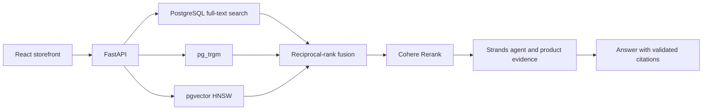

# Build agentic hybrid retrieval with Amazon Aurora PostgreSQL

[](https://github.com/aws-samples/sample-agentic-hybrid-retrieval-aurora-postgresql/actions/workflows/ci.yml)
[](https://github.com/aws-samples/sample-agentic-hybrid-retrieval-aurora-postgresql/actions/workflows/github-code-scanning/codeql)
[](LICENSE)

**Mosaic** is a product discovery application and hands-on workshop for building
search and agents whose results you can inspect. It combines PostgreSQL full-text
search, `pg_trgm`, pgvector HNSW, reciprocal-rank fusion (RRF), and Cohere Rerank
through Amazon Bedrock. A React storefront and FastAPI service expose the pipeline;
a Strands agent answers questions with citations to product evidence.

The workshop uses **553,911 real source products from Amazon Reviews 2023**, with
saved Cohere Embed v4 vectors. Fresh deployments restore those products and
vectors without loading historical synthetic rows or re-embedding the catalog.
Alex, the shopper whose home office guides the labs, is fictional.


**Start here:** [Workshop participants](START_HERE.md) · [Quick start](#quick-start) ·
[Workshop path](#workshop-path) · [Reuse the implementation](#take-hybrid-agentic-search-into-your-own-agent) ·
[Documentation](docs/index.md)

## Quick start

**Workshop Studio participants:** open [Start Here](START_HERE.md) in Code Editor
and follow the workshop guide. Your application and Aurora database are provisioned
by the workshop.

For application development, you need Python 3.13, [uv](https://docs.astral.sh/uv/),
Node.js 22.12+ with npm, PostgreSQL client tools, AWS credentials for Amazon Bedrock
in `us-east-1`, and access to an Aurora cluster with the Mosaic catalog loaded.
See [Aurora deployment](docs/aurora-deployment.md) for provisioning.

> [!IMPORTANT]
> **Aurora only.** There is no local database path. Set `DATABASE_URL` to the
> intended Aurora PostgreSQL cluster. Read [ARTIFACTS.md](ARTIFACTS.md) for the
> catalog restore contract and connection troubleshooting.

Install dependencies and configure the environment:

```bash
make setup
make ui-install
cp config/.env.example .env
```

Edit `.env` with your Aurora connection, selected catalog, and AWS configuration,
then start the API:

```bash
set -a
source .env
set +a
make api-serve
```

In a second terminal:

```bash
make ui-dev
```

Open **http://127.0.0.1:5173**. The API runs at `http://127.0.0.1:8000`;
`/api/health` and `/api/readiness` report its status. Override `UI_PORT` and
`API_PORT` when needed; the UI proxy follows `API_PORT`.

## Workshop path

The 60-minute workshop follows **Retrieve → Rank → Reason**. Each lab asks you to
observe a failure, diagnose its cause, repair the implementation, and prove the
change through the production path.

| Lab | What you repair | What you verify |
|---|---|---|
| **1. Build hybrid retrieval** | Reconnect typo-tolerant candidates | Listing-ID recovery, filtering, and vector recall |
| **2. Fuse, rerank, and inspect** | Restore reciprocal-rank contributions | Candidate membership, fusion arithmetic, and the reranking shortlist |
| **3. Build the retrieval agent** | Register retrieved evidence for synthesis | Independent product searches and claims supported by each product's own sources |

**Discover** introduces Alex's brief. **Shop** provides search, comparisons, and
Ask Mosaic. **Playground** exposes candidates, ranking, tool calls, citations,
and lab completion checks.

The checked-in source is the solved reference; workshop provisioning injects the
intentional faults. [The mission contract](data/evals/mosaic_labs_missions.json)
owns lab queries, timings, targets, and assertions. See the
[curriculum](docs/retrieval-curriculum.md), [lab design](docs/l400-lab-design.md),
and [presenter brief](workshop.md) for the full teaching sequence.

## Architecture



Eligibility filters apply before candidate limits. Aurora stores products,
vectors, source evidence, and retrieval receipts; the application records ranks,
settings, tool activity, and citations for inspection. Amazon Bedrock supplies
query embeddings, reranking, and agent models.

See the [architecture reference](docs/architecture.md) and
[API contract](docs/api-contract.md) for runtime boundaries and endpoints.

## Take hybrid agentic search into your own agent

Start with [Adapt the implementation](docs/use-in-your-app.md), which maps the
schema, SQL, evaluation runner, and citation checks to the files you change.
The [optional tool exercise](docs/build-retrieval-tool.md) provides a smaller
extension to try first.

The [Mosaic skill](skills/mosaic-hybrid-retrieval/SKILL.md) declares a
**four-operation HTTP skill surface** for a calling agent. Keep its reference
files together and follow the
[adaptation checklist](skills/mosaic-hybrid-retrieval/references/adapting.md).
It requires a compatible backend; it is **not a standalone retrieval runtime**.
A running Mosaic app serves the skill at `/api/skill-package` and an implementation
reading kit at `/api/builder-package`.

The optional [MCP adapter](docs/mcp-interoperability.md) exposes three typed,
catalog-read-only tools over the same API. Search still writes retrieval receipts.
[Session memory](docs/session-memory.md), [AgentCore Runtime](docs/agentcore-runtime.md),
and [telemetry export](docs/telemetry-contract.md) are separate extensions.

Validate the shared tool contracts with:

```bash
uv run python scripts/tool_contracts.py --check
```

## Validation

Run the offline checks without Aurora or Bedrock:

```bash
make lint
make validate
make validate-db
make validate-config
uv run python scripts/mission_contract.py --shape-only
PYTHONPATH=. uv run pytest -q
make ui-test
make ui-build
```

With `DATABASE_URL` set to the intended Aurora cluster:

```bash
MISSION_GATE_REQUIRE_DB=1 make validate-missions
make validate-evals
make db-verify-bootstrap
make test
```

The full Python gate includes 15 integration tests against Aurora. See
[READINESS.md](READINESS.md) for the complete release gates and
[the evaluation plan](docs/evaluation-plan.md) before running model-backed scoring.
Source CI does not certify a fresh deployment or a new relevance scorecard.
Saved [scale benchmarks](docs/current-scale-benchmarks.md) describe a historical
catalog; they do not certify the current real catalog.

For Workshop Studio updates, follow the [publishing runbook](docs/workshop-studio-publishing.md):
publish source, repin, verify and upload assets, sync static URLs, then push the
workshop repository and verify its build.

## Repository map

| Path | Contents |
|---|---|
| [`db/`](db/) | Aurora schemas, indexes, retrieval SQL, and lab code |
| [`service/`](service/) | FastAPI, retrieval orchestration, agent tools, and model clients |
| [`ui/`](ui/) | React storefront and Playground |
| [`scripts/`](scripts/), [`tests/`](tests/) | Data tooling, validation, evaluations, and tests |
| [`data/`](data/) | Dataset contracts, evaluation queries, and benchmark artifacts |
| [`deploy/`](deploy/) | Workshop bootstrap and delivery contract |
| [`mcp-server/`](mcp-server/), [`skills/`](skills/) | MCP adapter and portable agent instructions |
| [`docs/`](docs/index.md) | Architecture, labs, operations, and adaptation guides |

Read [AGENTS.md](AGENTS.md) and [house standards](docs/house-standards.md) before
editing. Retrieval settings belong in [retrieval.yaml](db/config/retrieval.yaml).
Review the [security boundaries](docs/security-boundaries.md) before adapting this
single-participant workshop sample to a shared application.

## Data, contributing, and license

The catalog derives from **Amazon Reviews 2023** (McAuley Lab, UC San Diego).
Evaluation examples also use **ESCI** and **WANDS**. [NOTICE.md](NOTICE.md)
records citations, uses, and third-party terms. Public redistribution of the
prepared catalog bundle remains unresolved; the bundle is excluded from Git.

See [CONTRIBUTING.md](CONTRIBUTING.md) and the [Code of Conduct](CODE_OF_CONDUCT.md).
Report security issues through the contributing guide's private reporting process.
Code is licensed under [MIT-0](LICENSE); datasets retain their own terms.
