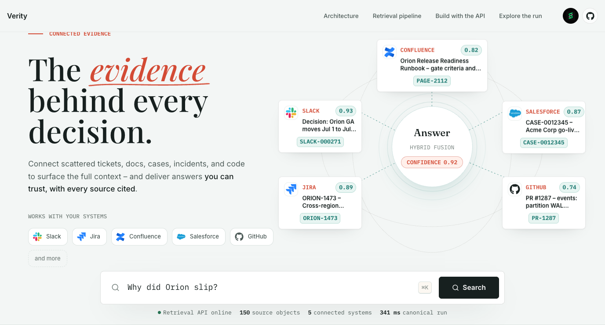
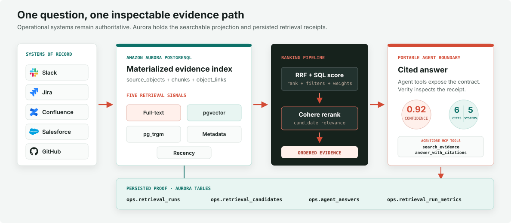
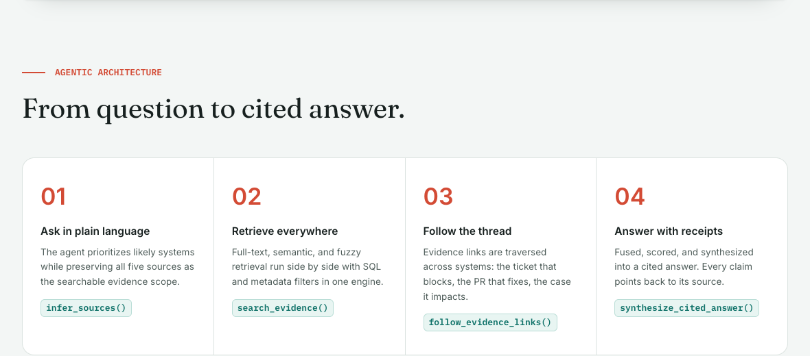

<h1 align="center">Verity</h1>

<p align="center">
  <strong>Agentic hybrid retrieval with Amazon Aurora PostgreSQL</strong><br />
  Turn fragmented operational records into ranked evidence, cited answers, and durable proof.
</p>

<p align="center">
  <a href="LICENSE"></a>
  <a href="https://github.com/aws-samples/sample-agentic-hybrid-retrieval-aurora-postgresql/commits/main"></a>
  <a href="https://www.python.org/downloads/"></a>
  <a href="https://nodejs.org/"></a>
  <a href="https://www.postgresql.org/"></a>
  <a href="https://github.com/pgvector/pgvector"></a>
</p>

<p align="center">
  <a href="https://aws.amazon.com/rds/aurora/"></a>
  <a href="https://aws.amazon.com/bedrock/"></a>
  <a href="https://aws.amazon.com/bedrock/agentcore/"></a>
  <a href="https://strandsagents.com/"></a>
  <a href="https://react.dev/"></a>
  <a href="https://vite.dev/"></a>
</p>

---

Verity is a security-reviewable reference implementation for the re:Invent 2026
builder session **Build agentic hybrid retrieval with Amazon Aurora PostgreSQL**.
It materializes evidence from operational systems into Aurora PostgreSQL, combines
lexical, semantic, fuzzy, metadata, and recency signals, reranks the fused result,
and returns a cited answer with a persisted retrieval receipt.

> [!NOTE]
> **Level 400 builder session · 60 minutes.** The React application is an inspection
> surface. The durable deliverable is the HTTP and MCP contract that participants
> can extend from Strands, Claude Code, LangGraph, or their own agent harness.

<p align="center">
  
</p>
<p align="center"><sub>One question, five connected systems, and a fully cited answer path.</sub></p>

## At a glance

| Layer | Implementation |
|---|---|
| Evidence index | Amazon Aurora PostgreSQL 18.3+, pgvector 0.8.1+, `tsvector`, `pg_trgm` |
| Retrieval | Full-text + semantic + fuzzy + metadata + recency, fused with weighted RRF |
| Ranking | Aurora SQL composite score, then Cohere Rerank v3.5 through Amazon Bedrock |
| Agent path | Strands tools with Sonnet 5 routing and Opus 4.8 synthesis |
| Portable boundary | FastAPI operations and `AWS_IAM`-authorized AgentCore Gateway MCP tools |
| Proof | Persisted runs, candidates, scores, citations, latency, query plans, and evaluation metrics |

## Prerequisites

- Python 3.13 or later
- Node.js 20.19 or later for the frontend and MCP server
- A Workshop Studio-provisioned Aurora PostgreSQL cluster in `us-east-1`
- AWS credentials that can read the workshop stack outputs and Secrets Manager database secret
- Bedrock model access for live query embeddings when `EMBED_PROVIDER=bedrock`

## What you build

Participants build a lightweight retrieval system that can answer questions like:

> Why did Orion slip, and which customer commitments are at risk?

The system:

1. Ingests operational source objects.
2. Normalizes records into a PostgreSQL schema.
3. Chunks long text.
4. Generates embeddings.
5. Stores source links and citations.
6. Runs PostgreSQL full-text search, pgvector semantic similarity, SQL filters, metadata filters, time-window filters, and pg_trgm fuzzy matching.
7. Combines retrieval sets with Reciprocal Rank Fusion.
8. Returns cited answers through Strands-style agent-callable tools.
9. Stores retrieval diagnostics for evaluation and explainability.
10. Publishes the stable search and answer operations through an `AWS_IAM`-authorized AgentCore Gateway.

## Architecture

<p align="center">
  
</p>
<p align="center"><sub>One question follows an inspectable path from authoritative systems to persisted proof.</sub></p>

Source systems remain authoritative. Aurora stores the searchable projection and
the proof required to reproduce an answer; it does not replace the systems where
teams collaborate, approve, or mutate operational records.

<p align="center">
  
</p>
<p align="center"><sub>The live inspection surface makes every retrieval and synthesis stage explicit.</sub></p>

## Portable contract

Verity is an inspection surface over the buildable boundary, not a required
frontend for downstream adopters:

- `POST /v1/search` returns a persisted `run_id`, retrieval mode, ranked evidence,
  and per-signal scores.
- `POST /v1/agent/answer` returns the cited answer, confidence, source coverage,
  and supporting run.
- Workshop Studio publishes those operations as `search_evidence` and
  `answer_with_citations` MCP tools through AgentCore Gateway.

Use the HTTP operations directly from your own orchestrator, or consume the MCP
catalog from Strands, Claude Code, LangGraph, or another MCP-aware harness. Keep
the returned `run_id` with your trace so the answer remains auditable.

## Production data pattern

This workshop does **not** recommend replacing Jira, Slack, Confluence,
Salesforce, GitHub, or other source systems with Aurora PostgreSQL. Those systems
remain authoritative for workflow, permissions, ownership, and mutation.

The recommended pattern is a **materialized evidence index** in Aurora
PostgreSQL:

- Store the searchable projection: source IDs, URLs, titles, excerpts or bodies,
  metadata, ACL markers, citations, relationships, embeddings, sync cursors, and
  provenance.
- Keep that projection fresh with connectors, webhooks, scheduled exports,
  AppFlow/Glue jobs, or an ingestion API.
- Use MCP tools and connectors for live lookups, actions, revalidation, and
  source-specific operations.
- Build the UI and agent search path over Aurora because hybrid retrieval,
  filtering, citation joins, diagnostics, and evaluation need a durable,
  queryable index.

The lab uses a committed seed bundle to stand in for the enterprise data
pipeline, so participants can focus on the retrieval schema and agent-facing
search behavior. In production, the same schema receives data from the
connectors or export jobs that fit each source system.

## Repository layout

```text
.
├── backend/                    # FastAPI API, ingestion pipeline, search, agent tools
├── frontend/                   # Vite + React UI
├── sql/                        # PostgreSQL schema, indexes, functions, diagnostics
├── data/                       # Workshop-safe source bundle
├── connectors/                 # Optional connector scaffolds and normalizers
├── lambda_mcp/                 # Lambda MCP adapter for Strands tool packaging
├── mcp-server/                 # Optional MCP wrapper around the retrieval API
├── seed/                       # Canonical Orion corpus generator + pg_dump/restore
├── mockups/                    # Static design prototype reference
├── scripts/                    # Setup helpers and SigV4 AgentCore Gateway client
└── docs/                       # Session plan, architecture, security notes, stretch labs
```

## Infrastructure boundary

This source repo does not provision AWS resources. The Workshop Studio repo owns:

- `static/hybrid-retrieval-main.yml` as the root CloudFormation template
- `assets/hybrid-retrieval-*.yml` as nested CloudFormation templates
- the packaged source archive that Workshop Studio uploads to the assets S3 bucket
- the Code Editor, Aurora PostgreSQL, VPC, IAM, AgentCore Gateway, Lambda target,
  and bootstrap workflow

Keep application code, SQL, seed data, connector scaffolds, and local runtime helpers here. Put infrastructure templates and deployment packaging in the Workshop Studio repo.

## Quick start

Set up Python dependencies:

```bash
make install
cp .env.example .env
export AWS_REGION=us-east-1
export AWS_DEFAULT_REGION=us-east-1
```

When Workshop Studio has deployed the lab, configure this checkout from the workshop stack outputs:

```bash
make aurora-local-env
make aurora-verify
make seed-load
```

Run the API:

```bash
make api
```

Run the frontend in a second terminal:

```bash
cd frontend
npm install
npm run dev
```

Run the preflight doctor from the repo root:

```bash
make doctor

# Optional strict mode for facilitator pre-room checks:
DOCTOR_REQUIRE_SERVERS=1 make doctor
```

`make doctor` checks Aurora connectivity, PostgreSQL and pgvector versions,
required extensions, seed dump SHA256, seed row counts, API health, frontend
health, Bedrock model configuration, Cohere Embed, and Cohere Rerank v3.5 via
Amazon Bedrock. API and frontend health are warnings by default so the command
can run before the two dev servers are started; `DOCTOR_REQUIRE_SERVERS=1` makes
them hard failures.

`make aurora-local-env` resolves the stack outputs, reads the database secret
from Secrets Manager, writes ignored local `.env` files for the backend and
frontend, and checks whether the Aurora endpoint is reachable from the local
machine. The files are intentionally not committed. If the network check says
Aurora is not reachable, run from Code Editor or another environment inside the
workshop VPC.

## Workshop seed

The demo answers one canonical question — **"Why did Orion slip?"** — and every
number the UI shows (the cited answer, the six sources, the timeline, the diagnostics
funnel) is backed by real rows in the `ops` schema, not hardcoded in the frontend.
The `seed/` directory regenerates that dataset and ships it as a `pg_dump -Fc`
archive so a workshop bootstrap can restore it with **$0 in Bedrock spend**.

```bash
# Restore the prebuilt corpus into the configured Aurora database (idempotent):
make seed-load

# Or regenerate from source (seed authors - writes JSONL + manifest + dump):
make seed-jsonl        # JSONL + manifest only, no database needed
make seed-generate     # full rebuild, populates DB and writes the -Fc dump
```

`load.sh` restores the dump, then **rebuilds indexes after the data load** — the
HNSW graph (`m=16, ef_construction=64, vector_cosine_ops`) plus the GIN full-text
and `pg_trgm` fuzzy indexes. See [`seed/README.md`](seed/README.md) for the full
workflow and the flagged divergences from the original design mockups.

The shipped dump carries **real Cohere `embed-v4` (1024-d)** vectors, generated
once at build time and reused by every restore. Because the stored vectors live in
Cohere space, run the backend with `EMBED_PROVIDER=bedrock` so live `/v1/search`
embeds queries with the same model. (The canonical Orion answer is served from a
stored row, so it renders identically under either provider.)

The visible result-card score separates the two stages. Cohere Rerank v3.5
provides a 0-1 rerank score when live reranking is enabled; the SQL score remains
Aurora's unbounded composite of vector, full-text, fuzzy, metadata, recency, and
RRF signals.

## Model routing

The lab defaults to `EMBED_PROVIDER=bedrock` so live query embeddings share the
Cohere `embed-v4` space the shipped dump was built in. Set `EMBED_PROVIDER=hash`
for a fully offline run (deterministic embeddings, no Bedrock calls) — useful for
CI or air-gapped setup, though live-query relevance will differ from the seeded
vectors. When Bedrock is enabled, the repo expects these model IDs:

```text
BEDROCK_OPUS_MODEL=global.anthropic.claude-opus-4-8
BEDROCK_SONNET_MODEL=global.anthropic.claude-sonnet-5
BEDROCK_ROUTER_MODEL=global.anthropic.claude-sonnet-5
BEDROCK_REPORTING_MODEL=global.anthropic.claude-sonnet-5
BEDROCK_CHAT_MODEL=global.anthropic.claude-opus-4-8
BEDROCK_EMBEDDING_MODEL=us.cohere.embed-v4:0
CLAUDE_CODE_MODEL=global.anthropic.claude-sonnet-5
COHERE_RERANK_MODEL=cohere.rerank-v3-5:0
```

`/v1/agent/answer` includes an `agent` metadata object so the app and lab can show the live routing:

- `planning_and_tool_routing`: Sonnet 5
- `answer_synthesis`: Opus 4.8

Cohere Rerank v3.5 runs after Aurora SQL fusion selects the candidate pool. AWS
access is through the Bedrock Agent Runtime `rerank` API, but the reranking model
is Cohere.

Claude Code CLI is a separate optional participant harness. Workshop Studio can
preload it with `CLAUDE_CODE_MODEL=global.anthropic.claude-sonnet-5` so attendees
can ask discovery questions about the repo or get help during code exercises. It
does not participate in the Strands agent answer path.

The canonical workshop answer is replayed from Aurora for stable citations and diagnostics; live composition paths use the configured synthesis model.

## Search

```bash
curl -X POST http://localhost:8000/v1/search \
  -H 'Content-Type: application/json' \
  -d '{
    "query": "Why did Orion slip, and which customer commitments are at risk?",
    "source_systems": ["slack", "jira", "confluence", "salesforce", "github"],
    "project_key": "ORION",
    "limit": 8
  }'
```

## Agent answer

```bash
curl -X POST http://localhost:8000/v1/agent/answer \
  -H 'Content-Type: application/json' \
  -d '{
    "question": "Why did Orion slip, and which customer commitments are at risk?",
    "limit": 8
  }'
```

## Repository conventions

- Keep local configuration in `.env`; only `.env.example` is committed.
- Keep generated corpora under `data/generated/`; it is ignored by git.
- Keep live connector exports under `data/live/`; it is ignored by git.
- The canonical workshop corpus lives in `seed/` (generator + committed dump);
  restore it with `make seed-load`.
- Use `SECURITY_REVIEW.md` for review notes that should remain visible to maintainers.

## Security

See [`SECURITY_REVIEW.md`](SECURITY_REVIEW.md). The package is intentionally review-friendly:

- No committed credentials.
- No real customer data.
- Workshop source data only.
- Optional connectors require explicit environment variables.
- Static connector logo assets are UI-only workshop visuals and contain no
  credentials or remote dependencies.
- No telemetry or analytics.
- No remote font or image dependencies in the React app.

For security issue notifications, see [`CONTRIBUTING.md`](CONTRIBUTING.md#security-issue-notifications).

## License

This project is licensed under the MIT-0 License. See [`LICENSE`](LICENSE) for
the authoritative copyright and license terms.

---

<p align="center">
  <strong>Designed and authored by Shayon Sanyal</strong><br />
  <sub>Workshop concept and experience © 2026 Shayon Sanyal · Published as an AWS Sample under the MIT-0 License</sub>
</p>
