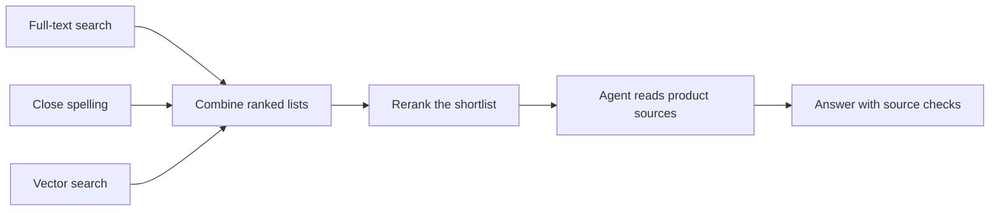

# Build agentic hybrid retrieval with Amazon Aurora PostgreSQL

In this workshop, you help Alex choose headphones, a monitor, and a chair for his
home office. You will build and inspect the search, ranking, and agent steps
behind **Mosaic**, a product discovery application.

The catalog contains **553,911 real source products from Amazon Reviews 2023**.
The product records and saved Cohere embeddings are provided. Alex is a fictional
shopper; your searches and answers use the source products and their evidence.

## Start the workshop

1. Open **Lab 1** in your Workshop Studio guide.
2. Open **Code Editor → [Start Here](START_HERE.md)** beside the guide. Your
   application, Aurora database, and terminal connection are already prepared.
3. Open Mosaic from the workshop and follow the guide's first search. Inspect
   the result before editing code.

You do not need to install dependencies or start a database or server during
the workshop. Follow the guide's commands as you move through the labs.

## What you will build

The workshop follows **Retrieve → Rank → Build an agent**. Labs 1 and 2 improve
your SQL search. Lab 3 connects that search to a Strands agent on AgentCore Runtime
and exposes the SQL tools through AgentCore Gateway.

| Lab | Question to answer | Where you work |
|---|---|---|
| **1. Build hybrid retrieval** | Can search find the intended product, even with a typo? | [Search SQL](db/sql/09_search_functions.sql) |
| **2. Fuse, rerank, and inspect** | How did each search method contribute to the final order? | [Ranking SQL](db/sql/09_search_functions.sql) |
| **3. Build and deploy an agent** | Can your agent use SQL tools and answer with sources? | [Strands agent](labs/lab3/agent.py) |

Use **Discover** to explore Alex's brief, **Shop** to search and compare products,
and **Playground** to inspect search results, ranking, tool calls, and sources.

Keep your predictions and explanations in Code Editor's `learning-notes.md`.
Save the before-and-after searches, and complete each lab's checks before moving
on. A plausible product or answer alone does not show that the repair worked.

## How the search works

Mosaic combines three ways to find products: PostgreSQL full-text search for
words, `pg_trgm` for close spellings, and pgvector HNSW for meaning.
Reciprocal-rank fusion (RRF) combines their ranked lists, then Cohere Rerank
reorders the shortlist for the request.

Aurora PostgreSQL holds the products, vectors, source records, and saved searches.
Filters determine which products are eligible before candidate limits apply.
Amazon Bedrock supplies query embeddings, reranking, and the agent model. The
application checks the evidence used in the answer. AgentCore Runtime hosts the
Strands agent, Gateway exposes its SQL tools over MCP, and AgentCore Memory
provides conversation context for the optional memory exercise.

You can inspect the [search settings](db/config/retrieval.yaml) and follow the
[architecture guide](docs/architecture.md) when you want more detail.

## Take it into your own project

After the labs, use **Adapt the implementation** and **Download the skill** in
Mosaic's Playground to take the workflow into your own agent.

- [Adapt the implementation](docs/use-in-your-app.md) maps the schema, retrieval
  SQL, ranking, evaluations, and citation checks to the files you change.
- The [Hybrid Agentic Search skill](skills/mosaic-hybrid-retrieval/SKILL.md) gives
  your agent instructions for finding products, comparing them, and checking
  sources. Keep its reference files together and follow the
  [adaptation checklist](skills/mosaic-hybrid-retrieval/references/adapting.md).
- [Build a retrieval tool](docs/build-retrieval-tool.md) is an optional extension
  for applying your own filtering rule.

The skill requires a running Mosaic service or compatible backend, configured
with its URL and authentication. The workshop endpoint expires with the event;
the download does not include a hosted service.

## Further reading

- [Developer setup and checks](docs/development.md) — run or contribute to the
  application outside the workshop. Database work always uses Aurora.
- [MCP integration](docs/mcp-interoperability.md) — connect another agent host.
- [Session memory](docs/session-memory.md) — explore saved preferences and conversations.
- [Documentation map](docs/index.md) — additional technical and operator guides.

## Data and license

See [NOTICE.md](NOTICE.md) for Amazon Reviews 2023, ESCI, and WANDS citations and
terms. The prepared catalog bundle is excluded from Git; its public redistribution
remains unresolved. Code uses the [MIT-0 license](LICENSE).
For contributions and security reporting, see [CONTRIBUTING.md](CONTRIBUTING.md).
