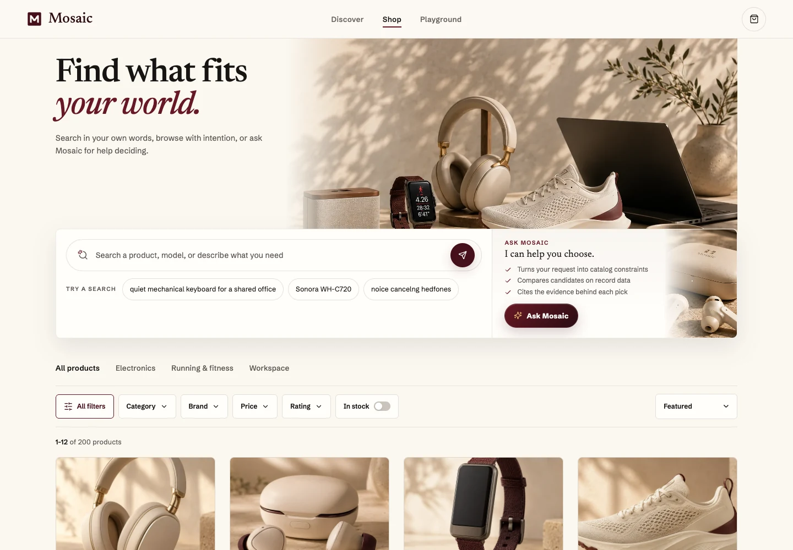
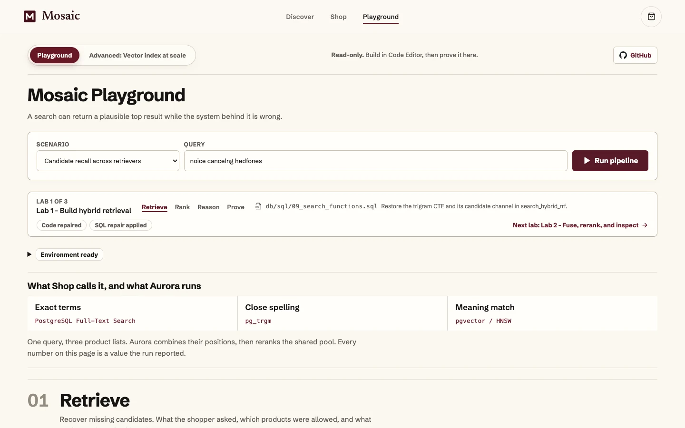

# Build agentic hybrid retrieval with Amazon Aurora PostgreSQL

[](https://github.com/aws-samples/sample-agentic-hybrid-retrieval-aurora-postgresql/actions/workflows/ci.yml)
[](https://github.com/aws-samples/sample-agentic-hybrid-retrieval-aurora-postgresql/actions/workflows/github-code-scanning/codeql)
[](https://github.com/aws-samples/sample-agentic-hybrid-retrieval-aurora-postgresql/actions/workflows/github-code-quality/codeql)
[](https://www.python.org/)
[](https://nodejs.org/)
[](https://www.postgresql.org/)
[](https://react.dev/)
[](LICENSE)

The session thesis is simple: **retrieval correctness is a pipeline property,
not a top-1 result**.

A search can return a plausible top result while the system behind it is
wrong. In this session you repair three failures that hide behind healthy
components: a missing candidate path, broken fusion masked by reranking, and
evidence that reaches an agent but cannot safely support its answer.

Mosaic is a production-shaped product discovery application that pairs
PostgreSQL full-text search, `pg_trgm`, pgvector HNSW, reciprocal-rank fusion,
and managed reranking with a React storefront, a typed FastAPI service, a
Strands agent, and an optional MCP 2.0 adapter, backed by a 500,000-product
synthetic catalog and deterministic release gates. The complete session
framing is in [the session abstract](docs/session-abstract.md).


> [!IMPORTANT]
> **Aurora only.** This project has no local database path. Every database
> command must receive a `DATABASE_URL` for the intended Aurora PostgreSQL
> cluster. See [ARTIFACTS.md](ARTIFACTS.md) before running any `db-*`, lab,
> evaluation, or API target.

**Jump to:** [Quick start](#quick-start) | [Architecture](#architecture) |
[Workshop path](#workshop-path) | [Validation](#validation) |
[Participant takeaway](#participant-takeaway) |
[Repository map](#repository-map)

## Quick start

Prerequisites:

- Python `3.13` and [`uv`](https://docs.astral.sh/uv/);
- Node.js `22` and npm, matching the workshop host, which installs the
  versioned `nodejs22 nodejs22-npm` pair and asserts `v22`
  in [`deploy/mosaic-bootstrap.sh`](deploy/mosaic-bootstrap.sh);
- PostgreSQL client tools;
- AWS credentials for Amazon Bedrock in `us-east-1`;
- an Aurora PostgreSQL `DATABASE_URL` for the Mosaic catalog.

Install the locked dependencies and create the runtime environment:

```bash
make setup
make ui-install
cp config/.env.example .env
```

Edit `.env`, then start the API:

```bash
set -a
source .env
set +a
make api-serve
```

Start the React application in a second terminal:

```bash
make ui-dev
```

Open `http://127.0.0.1:5173`. The API defaults to
`http://127.0.0.1:8000`. Override `UI_PORT`, `API_PORT`, or
`CATALOG_API_PROXY` when those ports are occupied.

For example, run the API with `make api-serve API_PORT=8014`, then run
`make ui-dev UI_PORT=5174 API_PORT=8014` in the second terminal. The UI proxy
follows `API_PORT`; an explicit `CATALOG_API_PROXY` takes precedence.

Useful runtime probes:

```bash
curl http://127.0.0.1:8000/api/health
curl http://127.0.0.1:8000/api/readiness
```

`/api/readiness` validates the live schema, product and embedding counts,
premium cohort, evidence coverage, required retrieval indexes and functions,
model-space compatibility, and AWS credential availability.

If `DATABASE_URL` contains `&`, keep it single-quoted when sourcing the file.
Corporate-network TLS and security-group diagnostics are documented in
[ARTIFACTS.md](ARTIFACTS.md).

## What Mosaic demonstrates

| Capability | Implementation | Inspectable proof |
|---|---|---|
| Exact and lexical retrieval | PostgreSQL weighted FTS with strict-query preservation | FTS rank, source URI, and persisted retrieval event |
| Typo recovery | `pg_trgm` candidate generation | Trigram similarity and rank contribution |
| Semantic retrieval | Cohere Embed v4 with pgvector HNSW | Vector distance, HNSW settings, and model identity |
| Product eligibility | SQL columns and JSONB predicates applied before fusion | Applied filters and production `matches_filters` checks |
| Candidate fusion | Unweighted reciprocal-rank fusion | Per-arm ranks, contributions, and pre-rerank order |
| Final ordering | Cohere Rerank 3.5 through Amazon Bedrock | Rerank score, final rank, and exact-identity preservation |
| Grounded recommendations | Strands tools over product and evidence records | Tool trace, retrieval IDs, evidence IDs, and numbered citations |
| Production diagnosis | Persisted events and on-demand `EXPLAIN (ANALYZE, BUFFERS, SETTINGS)` | Query plan, indexes, runtime settings, and Aurora identity |

The visible application surfaces are three, and each is reachable at the name
the navigation prints for it (`/discover`, `/shop`, `/playground`) as well as at
its canonical path (`/`, `/catalog`, `/labs/retrieval`), which is what workshop
instructions deep-link to:

- **Discover** - editorial product discovery, direct search, and excerpts from
  the synthetic review corpus. Filter links render with the page; counts and
  reviews are prefetched, with successful editorial reads reused for up to
  60 seconds when returning to Discover;
- **Shop** - hybrid search, filters, sorting, product detail, and Ask Mosaic.
  Select two to five results and compare them side by side; the
  comparison is served by `POST /api/retrieval/events/{id}/compare`, which
  retrieves nothing and reads that run's persisted receipt, so it shows which
  arms found each product and how reranking moved it. The tick boxes appear
  only once a search has run, because a retrieval's grant is what authorises
  a comparison. A search whose words the catalog does not carry says so above
  the results;
- **Playground** - Retrieve, Rank, and Reason appear side by side on laptop and
  desktop screens. Follow matching products, changes in rank, and the agent’s
  progress and answer, then open search details and sources within each column.
  Each column ends with a **Keep in mind** line naming the lesson it proves,
  the same line the opening slides carry.
  Retrieve and Rank follow the same preview products before and after reranking.
  Each recommendation links to the search that returned it, including when the
  agent uses more than one search. All three columns use the full product title,
  and photos stay consistent with Shop. Shop links open the saved search; **Start a new run** searches
  again, with a way back to the saved Shop results.
  Clearer calls is the starting request. Plan my workspace demonstrates separate
  searches for two product needs; Check the sources compares specification and
  sample review records read by the agent. Coding exercises and adaptation guides
  live in the workshop and take-home documentation.
  **Session & Memory** explores AgentCore conversation events, semantic facts,
  user preferences, session summaries and episodic memory. Inspect the connected
  strategies and extracted records, then recall relevant context in a new
  session. Aurora still supplies product evidence. See [setup and behavior](docs/session-memory.md).
   Scale & HNSW includes an interactive
  3D graph illustration, Off / Strict / Relaxed scan comparisons, and full
  precision, halfvec and binary measurements. Detailed benchmarks and SQL are
  available in an expandable section.

The storefront is designed for laptop browser viewports at normal zoom. Page
navigation keeps the header in place and restores scroll and keyboard focus.
Ask Mosaic shows retrieval progress before bringing the cited answer forward
and folding the activity into **Steps and sources**.

<details>
<summary>See Shop and Playground</summary>





</details>

Search and agent results always come from the API. The UI does not recreate
retrieval scores or silently substitute fixture products when Aurora, Bedrock,
reranking, evidence, or synthesis is unavailable.

## Architecture


Aurora is both the search engine and the context system: canonical product
metadata, FTS documents, trigram-normalized text, structured attributes,
embeddings, HNSW indexes, evidence, retrieval events, judgments, and benchmark
records remain in one transactionally consistent data plane.
Search, model invocation, and synthesis span multiple transactions; persisted
receipts connect those stages.

See [the architecture reference](docs/architecture.md) and
[the API contract](docs/api-contract.md) for the complete runtime boundaries.

## Workshop path

The 60-minute session reserves 12 minutes for an Introduction / Overview /
Presentation, 40 minutes for the three labs (including their proofs and the
completion gate), and 8 minutes for optional work or recovery:

```text
RETRIEVE -> RANK -> REASON
```

| Lab | Time | Participant outcome |
|---|---:|---|
| **1. Build hybrid retrieval** | 10 min | Prove the right eligible candidates entered the pool, then reconnect one missing candidate arm |
| **2. Fuse, rerank, and inspect** | 10 min | Repair `1 / (k + rank)` and prove why a correct final answer can hide incorrect fusion |
| **3. Build the retrieval agent** | 20 min | Attach evidence identity to application-owned synthesis state and prove every citation resolves |

The checked-in source is the solved reference implementation. Deliberate
starter states are injected by `scripts/lab_state.py`; a failure already present
in the repository is a defect, not an exercise. The single source for lab
timings, queries, targets, assertions, and checkpoints is
[`data/evals/mosaic_labs_missions.json`](data/evals/mosaic_labs_missions.json).

In Playground, **Code repaired** describes the exercise file and **SQL repair
applied** describes the installed Aurora function. Completion proof separately
checks the recorded behavior. Starting a new run clears the previous run's
proof. Both the browser and CLI run the mission's required supporting controls;
Reason also requires independent target searches and a retrieval explanation.

Build your own filtered tool with [the hands-on extension](docs/build-retrieval-tool.md),
then follow [the implementation map](docs/use-in-your-app.md) to adapt the schema,
ranking SQL and evidence boundary.

Read [the curriculum](docs/retrieval-curriculum.md) and
[the intentional-gap contract](docs/intentional-gaps.md) before changing a lab
seam.

The companion Workshop Studio project owns participant instructions,
provisioning-time gap injection, deployment automation, and the clean-account
rehearsal. Repository checks prove the source contract; they do not replace
fresh-stack deployment and projector rehearsal.

## Release baseline

The Aurora release contract verifies:

| Property | Baseline |
|---|---:|
| Aurora PostgreSQL | 18.x |
| pgvector | 0.8+ |
| Products | 500,000 |
| Product embeddings | 500,000 |
| Embedding model | `us.cohere.embed-v4:0` |
| Embedding dimensions | 1,024 |
| Rerank model | `cohere.rerank-v3-5:0` |
| Agent and synthesis model | `global.anthropic.claude-sonnet-4-6` |
| Premium visual cohort | 120 products |
| Photographed Shop edit | 200 products |
| Product specification coverage | 500,000 products |
| Generated review evidence | 15,000 records |
| Filter-contract cases | 720 |
| Canonical scorecard | 20 product retrieval cases plus 1 agent contract case |

The catalog is synthetic and represents no real products, reviews, or customer
testimony. It spans three domains:

| Domain | Products | Retrieval emphasis |
|---|---:|---|
| Consumer electronics | 210,000 | model and SKU precision, compatibility, specifications, lexical ambiguity |
| Running and fitness | 160,000 | semantic intent, nuanced attributes, hard negatives |
| Home office and workspace | 130,000 | ergonomic intent, dimensions, compatibility, selective filters |

The three compressed catalog shards are checked into `data/full/`; their load
order, size limits, and SHA-256 digests are enforced by the dataset contract.
Real Cohere embeddings are not stored in Git. Workshop Studio restores them
from a pinned, content-addressed cache into a fresh encrypted Aurora cluster.
Hash embeddings require explicit development opt-in and cannot support workshop
relevance claims.

## Validation

### Offline contracts

These checks do not make Aurora or Bedrock readiness claims:

```bash
make setup
make lint
make validate
make validate-db
make validate-config
make validate-release-workflow
uv run python scripts/mission_contract.py --shape-only
PYTHONPATH=. uv run pytest -q

make mcp-install
make mcp-test
make mcp-wheel-smoke

make ui-install
make ui-test
make ui-build
make ui-audit
```

### Aurora-backed release gates

With `DATABASE_URL` pointing at the intended Aurora cluster:

The full Python gate includes 14 read-only integration tests against Aurora.

```bash
MISSION_GATE_REQUIRE_DB=1 make validate-missions
make validate-evals
FUNCTION_CENSUS_REQUIRE_DB=1 make validate-functions
make db-verify-bootstrap
make test
make test-aurora-invariants
make score-evals
```

`make validate-evals` proves the 720 target/filter contracts through the
production `mosaic_search.matches_filters` function. `make score-evals` runs
the served retrieval path over the canonical scorecard and verifies source,
dataset, retrieval-profile, model, Aurora, ranked-result, and metric provenance.
It is a release gate, not a general benchmark command.

These assets answer different questions:

- golden lab anchors ask whether critical behavior regressed;
- the 20 product-retrieval cases measure retrieval quality;
- the 720 generated fixtures test whether filters violated their contract.

The [current scale benchmarks](docs/current-scale-benchmarks.md) cover all 30
anchor products across the current 500,000-vector Aurora catalog, with exact
top-10 comparisons and warm database p50/p95 timings. The report includes the
rerun command and raw samples. `scripts/benchmark_mosaic_scale.py` refreshes the
current artifact; `scripts/benchmark_hnsw.py` is the older sweep-only runner.
`scripts/simulate_scale.py` produces a labeled projection and must not be
presented as benchmark evidence.

See [READINESS.md](READINESS.md) and
[the evaluation plan](docs/evaluation-plan.md) before accepting or publishing a
new scorecard.

## Continuous integration and security

[`Project CI`](.github/workflows/ci.yml) runs the offline Python, configuration,
schema-package, MCP, UI, build, and dependency-audit gates on pull requests and
pushes to `main`.

Release checks run on a networked self-hosted runner labeled `mosaic-aurora`:

| Job | Trigger | Required configuration |
|---|---|---|
| Non-billed Aurora release contracts | A `v*` tag or manual workflow dispatch, after offline checks | `MOSAIC_AURORA_DATABASE_URL` and the `MOSAIC_WORKSHOP_REPO` repository variable |
| Billed model-backed Aurora invariants | After the non-billed job, on those same release triggers | Approval through `mosaic-aurora-billed`, plus `MOSAIC_AURORA_CI_ROLE_ARN` and OIDC access in `us-east-1` |
| Billed canonical scorecard | Manual dispatch with `run_billed_scorecard=true`, after both preceding jobs | The same approved environment, database, AWS role, and OIDC access |

The non-billed job checks the published Studio pin and bootstrap, live missions,
filter contracts, function census, bootstrap acceptance, and SQL integration.
Model invocations are confined to the billed jobs. A green source CI badge
does not certify a fresh Workshop Studio deployment or a new scorecard.

GitHub CodeQL default setup scans Python and JavaScript/TypeScript; Code Quality
runs as a separate GitHub workflow. Actions are
pinned to full commit SHAs, workflow permissions are minimal, and dependency
auditing is part of the UI gate.

### Publish source and repin Workshop Studio

Commit and push the validated application changes before repinning. From the
companion Workshop Studio checkout, run:

```bash
uv run --no-project --with PyYAML==6.0.3 python scripts/repin.py \
  --source-repo ../sample-agentic-hybrid-retrieval-aurora-postgresql
uv run --no-project --with PyYAML==6.0.3 python scripts/repin.py --check \
  --source-repo ../sample-agentic-hybrid-retrieval-aurora-postgresql
```

The repin requires a clean source checkout at published `origin/main`. It
updates every source-revision consumer, the bootstrap hash, and the derived
infrastructure revision together. The event owner then publishes the Studio
assets to S3, verifies the delivered bootstrap, validates the Studio checkout,
and commits and pushes that repository. The complete procedure belongs to its
`FACILITATOR_GUIDE.md`.

## Aurora bootstrap and recovery

The portable Workshop Studio path imports the checked-in catalog and a verified
embedding cache:

```bash
make db-fetch-embeddings \
  EMBEDDING_CACHE_URI=s3://example-workshop-assets/mosaic/embedding-cache/

make db-bootstrap-cached \
  DATABASE_URL="$DATABASE_URL" \
  EMBEDDING_CACHE_MANIFEST=build/embedding-cache/manifest.json
```

The cache contains resumable float32 NPZ shards and a SHA-256 manifest.
Changed, missing, or model-incompatible products fail import instead of silently
receiving stale vectors. A cluster snapshot remains the fast same-account
operator recovery path; the cache is the portable cross-account path.

The supplied infrastructure is intentionally workshop-shaped. A production
deployment must choose its own high-availability, backup, deletion-protection,
authentication, connection-pooling, monitoring, and retention policies.

The complete restore policy and the non-recoverable predecessor history are in
[ARTIFACTS.md](ARTIFACTS.md).

## Optional MCP contract

MCP interoperability is supported reference material rather than a fourth
required lab. The isolated MCP 2.0 environment exposes three typed,
catalog-read-only product search, product evidence, and retrieval-run inspection
tools over the same API:

```bash
make mcp-install
make mcp-test
make mcp-serve
```

Search still appends retrieval and candidate receipts, so it is intentionally
non-idempotent and requires write capacity for observability data. It never
mutates catalog or business records.

Connect a compatible host to `http://127.0.0.1:8001/mcp`. The agent and MCP
surfaces are projections of
[`db/config/agent_tool_contracts.json`](db/config/agent_tool_contracts.json);
they do not maintain independent retrieval schemas.

See [the MCP interoperability guide](docs/mcp-interoperability.md).

## Optional telemetry export

Aurora stores the canonical Retrieve → Rank → Reason evidence ledger. Mosaic
also defines an optional, aggregate-only OpenTelemetry projection for agents
observed through Amazon Bedrock AgentCore without moving the current runtime or
deploying AgentCore resources in Workshop Studio. Prompt/answer capture and the
AWS exporter are both opt-in.

Aurora stays the ledger and the projection stays aggregate: stage timings,
candidate counts, rerank and completion status, model and token metadata, and
correlation identifiers, with no product identity or evidence text.
`service/telemetry.py` and `service/telemetry_contract.py` emit nothing until an
operator installs the exporter with `uv sync --extra agentcore-observability` and
sets `MOSAIC_AGENTCORE_OBSERVABILITY=true`. The repository ships the AWS Distro
for OpenTelemetry path; the application configures no exporter of its own, so
where spans go is an operator choice. No AgentCore resource sits in the required workshop
path, and no lab reads a span.

See [the portable telemetry contract](docs/telemetry-contract.md).

## Participant takeaway

Three artifacts transfer to another catalog without Mosaic, and one wrapper
describes how an agent calls them. Each lab repairs one of the three.

| Take home | Where it lives | What it proves |
|---|---|---|
| **The SQL.** Three candidate arms with eligibility applied inside each, unweighted reciprocal rank fusion over rank positions, and a bounded pool handed to the reranker. | [`db/sql/09_search_functions.sql`](db/sql/09_search_functions.sql), tuned only by [`db/config/retrieval.yaml`](db/config/retrieval.yaml) | Labs 1 and 2: a healthy arm can be disconnected from fusion, and fusion arithmetic can be wrong while the page looks right. |
| **The eval.** Twenty graded searches scored on Recall@10, MRR and nDCG@10, and a stage ablation that scores each arm alone, all three combined, and combined then reranked. | [`scripts/score_evals.py`](scripts/score_evals.py), [`scripts/ablation_evals.py`](scripts/ablation_evals.py), [`data/evals/`](data/evals/) | Prove, and the **Without hybrid** table on the Playground's Retrieve column. Copy the harness and replace the query set. |
| **The guard.** Retrieved evidence is registered and authorized by the application before synthesis may cite it, and the claim checks reject what the evidence cannot support. | [`service/agent_tools.py`](service/agent_tools.py), [`service/synthesis.py`](service/synthesis.py) | Lab 3: the model requests tools; the application decides what runs and what is citable. |
| **The skill.** The four-operation contract a calling agent uses. | [`skills/mosaic-hybrid-retrieval/`](skills/mosaic-hybrid-retrieval/) | A description of the capability, not a runtime: callers still need a deployed service implementing the contract. |

Keep the skill folder together: `SKILL.md` declares the four-operation HTTP
skill surface, and its references provide the generated argument-to-HTTP map,
the exact HTTP/MCP/A2A deployment status, and an adaptation checklist. The
optional build-a-tool exercise is additional practice in the Workshop Studio
guide.

The reusable teachings are the architecture's invariants: apply hard eligibility
before candidate limits, bound every retrieval stage, fuse before reranking,
persist replayable receipts, separate served results from downstream grants,
and keep source attribution attached to evidence. Adopters must replace
Mosaic-specific schema, taxonomy, language configuration, embedding dimensions,
models, tuning, identity, retention, and evaluation data rather than copying
them as defaults.

Validate the package and its live FastAPI bindings with:

```bash
uv run python scripts/tool_contracts.py --check
```

Start with [the skill](skills/mosaic-hybrid-retrieval/SKILL.md), then use
[the adaptation guide](skills/mosaic-hybrid-retrieval/references/adapting.md)
when mapping it to another domain.

## Sources of truth

Do not duplicate these contracts:

| Contract | Source |
|---|---|
| Candidate limits, fusion `k`, weights, trigram threshold | [`db/config/retrieval.yaml`](db/config/retrieval.yaml) |
| Lab queries, checkpoints, timings, targets, assertions | [`data/evals/mosaic_labs_missions.json`](data/evals/mosaic_labs_missions.json) |
| Assertion vocabulary and falsifiers | [`service/assertions.py`](service/assertions.py) |
| Agent, MCP, and skill tool schemas | [`db/config/agent_tool_contracts.json`](db/config/agent_tool_contracts.json) |
| Dataset load order and domain counts | [`data/full/manifest.json`](data/full/manifest.json) |
| Product-bound media contract | [`data/media/asset_labels_200.json`](data/media/asset_labels_200.json) |

Repository gates reject duplicate retrieval constants, configuration drift,
missing falsifiers, malformed mission contracts, stale SQL defaults, and
multiple live signatures for retrieval functions.

## Repository map

```text
config/       Runtime configuration and environment example
data/         Catalog shards, dictionaries, evaluations, and media manifests
db/           Aurora schemas, loaders, indexes, retrieval functions, and labs
deploy/       Source-owned Code Editor bootstrap and delivery contract
docs/         Architecture, curriculum, evaluation, operations, and UI contracts
mcp-server/   Isolated MCP 2.0 adapter
scripts/      Data, embedding, validation, scorecard, and benchmark tooling
service/      FastAPI, retrieval orchestration, Strands tools, and model clients
skills/       Participant takeaway skill, checked adapter map, and adaptation guidance
tests/        Dataset, SQL, API, provenance, and release-contract tests
ui/           React storefront, Ask Mosaic, and the Playground
```

Start with:

- [Documentation map](docs/index.md)
- [Architecture](docs/architecture.md)
- [API contract](docs/api-contract.md)
- [Portable telemetry contract](docs/telemetry-contract.md)
- [Retrieval curriculum](docs/retrieval-curriculum.md)
- [Evaluation plan](docs/evaluation-plan.md)
- [House standards](docs/house-standards.md)
- [Production-readiness checklist](docs/production-readiness.md)

## Contributing

See [CONTRIBUTING.md](CONTRIBUTING.md) and the
[Amazon Open Source Code of Conduct](CODE_OF_CONDUCT.md). Report security issues
through the process described in the contributing guide, not through a public
issue.

## License

This project is licensed under the [MIT No Attribution License](LICENSE).
