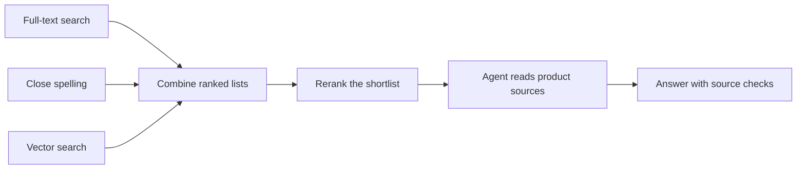

# Build agentic hybrid retrieval with Amazon Aurora PostgreSQL

In this workshop, you help Alex choose headphones, a monitor, and a chair for his
home office. You will build and inspect the search, ranking, and agent steps
behind **Mosaic**, a product discovery application.

The catalog contains **553,911 real source products from Amazon Reviews 2023**.
The product records and saved Cohere embeddings are provided. Alex is a fictional
shopper; your searches and answers use the source products and their evidence.

## Start the workshop

1. Open **Lab 1** in your Workshop Studio guide.
2. Open **Code Editor → [Start Here](START_HERE.md)** beside the guide. Your
   application, Aurora database, and terminal connection are already prepared.
3. Open Mosaic from the workshop and follow the guide's first search. Inspect
   the result before editing code.

Claude Code in the prepared terminal can help you investigate a lab. The
project's [AGENTS.md](AGENTS.md), loaded by [CLAUDE.md](CLAUDE.md), gives it the
lab map, validation commands and exercise boundaries. Share your current lab
and observed result; ask for a hint before a full recovery.

You do not need to install dependencies or start a database or server during
the workshop. Follow the guide's commands as you move through the labs.

## What you will build

The workshop follows **Retrieve → Rank → Re-rank → Reason**. Labs 1 and 2 improve
your SQL search. Lab 3 connects that search to a Strands agent on AgentCore Runtime
and exposes the SQL tools through AgentCore Gateway.
`uv run python scripts/deploy_agentcore.py deploy` builds an ARM64 container from your current source, pushes it to the workshop's ECR
repository and updates both runtimes. Docker and registry access are prepared
for you; the command checks deployed source identity and Gateway connectivity.

| Lab | Question to answer | Where you work |
|---|---|---|
| **1. Fix broken retrieval** | Can search find the intended product, even with a typo? | [`labs/lab1_retrieve/`](labs/lab1_retrieve/) |
| **2. Fix broken ranking** | **2a Rank:** which candidates survive fusion? **2b Re-rank:** how does their order change? | [`labs/lab2_rank/`](labs/lab2_rank/) |
| **3. Build and deploy the agent** | Can your agent complete Alex’s room with headphones, monitor and chair, citing each product’s sources? | [`labs/lab3_reason/`](labs/lab3_reason/) |

The participant workspace, [Mosaic.code-workspace](Mosaic.code-workspace),
groups the existing files as **01 — Retrieve**, **02 — Rank & Re-rank**, and **03 — Reason**.
Code Editor starts with the **Dark Modern** theme, independent of the device's
light or dark appearance. Participants can change the theme in Code Editor.
**Explore Mosaic source** keeps the complete repository accessible; prepared
terminals run commands from its root. Each lab README follows **Broken →
Diagnose → Fix → Prove**, with a collapsed recovery section linking the
reference answer in `solution/`. Solution folders are hidden from the default
Explorer view. When a lab starts, its
marked blocks hold a `TODO(Lab n)` note that repeats the guide's contract.

Use **Shop** to meet Alex and to search and compare products, and **Playground**
to inspect search results, ranking, tool calls, and sources. Shop opens on its
search and a browsable workspace shelf, with category links and **Browse all
products** above Alex's brief and the three editorial bands. A search
replaces the story with ranked results: the first as a feature, the rest as rows
with their positions.
Playground exposes four phases across three labs. **Focus at home** runs the deck’s exact headphone query. The retrieval pills run exact requests; **Reason** asks about the same need and preserves the original search alongside the agent’s focused searches. **Complete my room** uses Lab 3’s canonical three-product request. A compact summary
links each final choice to its search; **Trace all returned products** shows
search positions, comparisons, evidence read, and inclusion in the answer.
Retrieve, Rank and Re-rank inspect one selected search, whose first result is explicitly
labelled by search and position. Re-rank can inspect the complete saved candidate pool, including products outside the displayed result window. The agent's cited answer appears beside its
sources; search records and interpretation expand when needed. When a lab's request fails,
every surface says what is missing, why, and the one command to run next. On Shop,
Lab 1's failure is a card for the missing product with numbered steps back to it.
On Shop, **Why this match** itemizes how each result was found and ranked, and
product pages show the specifications a listing states beside the listing text
they came from. In **Session & Memory**, follow the linked steps to save a
preference, inspect its extraction, and ask in a new session. Recalled preferences
inform both retrieval and the final answer check; product claims still require
fresh evidence. On **Scale & HNSW**, **How HNSW finds neighbors** builds a real HNSW
index in the browser over a small product map: choose a request, the search effort
(`ef_search`) and links per product (`m`), then watch the descent through the layers,
the distance checks and the recall against an exact search. Request failures appear beside the question; completed answers
stay visible while history refreshes. **Ask Mosaic** shows its search, comparison and source activity as it runs, with
compact summaries and expandable evidence. Its answer leads with the best pick's photo, then a
side-by-side table in which each value shows whether the listing, its title, or a
review states it, with source numbers, then the cited answer and what its
sources leave unknown. Mosaic follows your device's light or dark appearance; the
header button switches it.

Every command in the guides is a `uv run` script in the Code Editor terminal.
Begin each lab with `uv run python scripts/lab_state.py start --lab N`. It saves
the lab's failing request; for Labs 2 and 3 it also installs that lab's fault,
once, and keeps your earlier repairs. Run it again after an interruption and it
finishes the missing step without reinstalling the fault over your edits. Until
you start them, Labs 2 and 3 read **Not started**: the checkout ships them
repaired, so their code is the workshop's reference, not your work. Lab 2 needs
your Lab 1 repair applied, and Lab 3 needs both; a start that finds one missing
says how to finish it and changes nothing.

`uv run python scripts/lab_state.py reset --lab N` discards only that lab's
edits and restores its starter. `uv run python scripts/lab_state.py solution
--lab N` overwrites that lab with the reference repair; it is a recovery route,
not a completion. A lab is complete when its own check passes.

Keep your predictions and explanations in Code Editor's `learning-notes.md`.
Save the before-and-after searches, and complete each lab's checks before moving
on. A plausible product or answer alone does not show that the repair worked.

## How the search works

Mosaic combines three ways to find products: PostgreSQL full-text search for
words, `pg_trgm` for close spellings, and pgvector HNSW for meaning.
Reciprocal-rank fusion (RRF) combines their ranked lists, then Cohere Rerank
reorders the shortlist for the request. The default RRF gives each channel the
same rank-based contribution. The Rank guide offers an optional weighted-RRF
comparison after required completion, using the same candidate lists; it does
not change the default search.

Bootstrap prepares Lab 2's judged-query cache on the workshop's own Aurora
indexes, using the production HNSW configuration. The cache is tied to the
rendered reference SQL, real-catalog filters and search settings. Release tests
check the reference cache's identity; grading checks the prepared cache against
Aurora and repeats live searches.

```mermaid
flowchart LR
    FTS[Full-text search] --> RRF[Combine ranked lists]
    TRGM[Close spelling] --> RRF
    VECTOR[Vector search] --> RRF
    RRF --> RERANK[Rerank the shortlist]
    RERANK --> AGENT[Agent reads product sources]
    AGENT --> ANSWER[Answer with source checks]
```

Aurora PostgreSQL holds the products, vectors, source records, and saved searches.
Filters determine which products are eligible before candidate limits apply.
Amazon Bedrock supplies query embeddings, reranking, and the agent model. The
application checks the evidence used in the answer. AgentCore Runtime hosts the
Strands agent, Gateway exposes its SQL tools over MCP, and AgentCore Memory
provides conversation context for the optional memory exercise.

You can inspect the [search settings](db/config/retrieval.yaml) and follow the
[architecture guide](docs/architecture.md) when you want more detail.

## Take it into your own project

Connect your agent to the retrieval tools, then add the skill to guide the
workflow. **Connect retrieval tools** in Mosaic links to the MCP setup and HTTP
contracts. **Download the skill** adds search, comparison and source-checking
instructions; **Adapt the implementation** supplies reference code.

The tools are catalog-read-only; searches still append audit records. MCP tool
annotations and skill instructions do not grant or restrict database access.
The service checks requests and the database role enforces its privileges.
See [the access boundary and official references](docs/mcp-interoperability.md#permissions-and-workflow-guidance).

- [Adapt the implementation](docs/use-in-your-app.md) maps the schema, retrieval
  SQL, ranking, evaluations, and citation checks to the files you change.
- The [Hybrid Agentic Search skill](skills/mosaic-hybrid-retrieval/SKILL.md) gives
  your agent instructions for finding products, comparing them, and checking
  sources. Keep its reference files together and follow the
  [adaptation checklist](skills/mosaic-hybrid-retrieval/references/adapting.md).
- [Build a retrieval tool](docs/build-retrieval-tool.md) is an optional extension
  for applying your own filtering rule.

The skill requires a running Mosaic service or compatible backend, configured
with its URL and authentication. The workshop endpoint expires with the event;
the download does not include a hosted service.

## Further reading

- [Developer setup and checks](docs/development.md) — run or contribute to the
  application outside the workshop. Database work always uses Aurora.
- [MCP integration](docs/mcp-interoperability.md) — connect another agent host.
- [Session memory](docs/session-memory.md) — explore saved preferences and conversations.
- [Documentation map](docs/index.md) — additional technical and operator guides.

## Data and license

See [NOTICE.md](NOTICE.md) for Amazon Reviews 2023, ESCI, and WANDS citations and
terms. The prepared catalog bundle is excluded from Git; its public redistribution
remains unresolved. Code uses the [MIT-0 license](LICENSE).
For contributions and security reporting, see [CONTRIBUTING.md](CONTRIBUTING.md).
