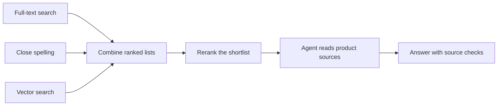

# Build agentic hybrid retrieval with Amazon Aurora PostgreSQL

In this workshop, you help Alex choose headphones, a monitor, and a chair for his
home office. You will build and inspect the search, ranking, and agent steps
behind **Mosaic**, a product discovery application.

The catalog contains **553,911 real source products from Amazon Reviews 2023**.
The product records and saved Cohere embeddings are provided. Maintainer restore
and validation commands use this real catalog; synthetic fixtures and loaders
have been retired. Alex is a fictional
shopper; your searches and answers use the source products and their evidence.

## Start the workshop

1. Open **Lab 1** in your Workshop Studio guide.
2. Open **Code Editor → [Start Here](START_HERE.md)** beside the guide. Your
   application, Aurora database, and terminal connection are already prepared.
3. Open Mosaic from the workshop and follow the guide's first search. Inspect
   the result before editing code.

Claude Code in the prepared terminal can help you investigate a lab. The
project's [AGENTS.md](AGENTS.md), loaded by [CLAUDE.md](CLAUDE.md), gives it the
lab map, validation commands and exercise boundaries. Share your current lab
and observed result; ask for a hint before a full recovery.

You do not need to install dependencies or start a database or server during
the workshop. Follow the guide's commands as you move through the labs.

📷 Mosaic and Alex's home office

## What you will build

The workshop follows **Retrieve → Rank → Re-rank → Reason**. Labs 1 and 2 improve
your SQL search. Lab 3 connects that search to a Strands agent on AgentCore Runtime
and exposes the SQL tools through AgentCore Gateway.
`uv run python scripts/deploy_agentcore.py deploy` builds an ARM64 container from your current source, pushes it to the workshop's ECR
repository and updates both runtimes. Docker and registry access are prepared
for you; the command checks deployed source identity and Gateway connectivity.

| Lab | Question to answer | Where you work |
|---|---|---|
| **1. Debug hybrid search** | Can search find Alex's Logitech Zone 900 headphones from a mistyped listing ID? | [`labs/lab1_retrieve/`](labs/lab1_retrieve/) |
| **2. Tune rank fusion and reranking** | **2a Rank:** which candidates survive fusion? **2b Re-rank:** how does their order change? | [`labs/lab2_rank/`](labs/lab2_rank/) |
| **3. Build and deploy the agent** | Can your agent help Alex complete his home office, bring the three choices together, and respond when his requirements change? | [`labs/lab3_reason/`](labs/lab3_reason/) |

The participant workspace, [Mosaic.code-workspace](Mosaic.code-workspace),
groups the existing files as **01 — Retrieve**, **02 — Rank & Re-rank**, and **03 — Reason**.
Code Editor starts with the **Dark Modern** theme, independent of the device's
light or dark appearance. Participants can change the theme in Code Editor.
**04 — Explore Mosaic source** opens the application source; prepared
terminals run commands from its root. Maintainer-only files (tests, CI, release
records, lockfiles) are hidden from the Explorer but stay in the checkout. Each lab README follows **Broken →
Diagnose → Fix → Prove**, with a collapsed recovery section linking the
reference answer in `solution/`. Solution folders are hidden from the default
Explorer view. When a lab starts, its
marked blocks hold a `TODO(Lab n)` note that repeats the guide's contract.

Use **Shop** for product search and **Playground** for saved candidates,
ranking, tool calls and cited sources. **Ask Mosaic** opens from the pill in the
header on every page. **Complete my room** runs Lab 3's
three-product request, and its Ask Mosaic starter stays available before and after
you build the agent; it runs on its own filters and says when it clears Shop's.
Keep its original run ID for completion. Ask Mosaic's **Builder view** switch (off by default) adds the run's recorded steps, saved search ids and how each search ranked its products to every answer. The Playground's Prove page keeps the
maintainers' saved scorecard collapsed under **Maintainer measurements**; those
results do not grade your repairs.

The guide presents the essential actions in order, with reference material and
optional exercises collapsed. Each lab README is a short reminder beside the
file you edit. Start each lab with
`uv run python scripts/lab_state.py start --lab N`: it saves the failing request,
installs that lab's fault once and preserves earlier repairs. An interrupted
start resumes without overwriting edits. Finish and apply earlier repairs first.

After editing, apply SQL or deploy the agent, repeat the same request, and run
the guide's checks. Keep your predictions and explanations in
`learning-notes.md`. A plausible result or successful deployment alone is not
completion. Source records must support product claims; a USB-C port alone
does not establish laptop charging compatibility.

Use the guide's hints for recovery. Reset discards the selected lab's edits;
the solution action replaces them with the reference answer. Both still need
the lab's proof. Optional Memory and HNSW exercises follow completion.

## How the search works

Mosaic combines three ways to find products: PostgreSQL full-text search for
words, `pg_trgm` for close spellings, and pgvector HNSW for meaning.
Reciprocal-rank fusion (RRF) combines their ranked lists, then Cohere Rerank
reorders the shortlist for the request. The default RRF gives each channel the
same rank-based contribution. The Rank guide offers an optional weighted-RRF
comparison after required completion, using the same candidate lists; it does
not change the default search.

Bootstrap prepares Lab 2's judged-query cache on the workshop's own Aurora
indexes, using the production HNSW configuration. The cache is tied to the
rendered reference SQL, real-catalog filters and search settings. Release tests
check the reference cache's identity; grading checks the prepared cache against
Aurora and repeats live searches.

```mermaid
flowchart LR
    FTS[Full-text search] --> RRF[Combine ranked lists]
    TRGM[Close spelling] --> RRF
    VECTOR[Vector search] --> RRF
    RRF --> RERANK[Rerank the shortlist]
    RERANK --> AGENT[Agent reads product sources]
    AGENT --> ANSWER[Answer with source checks]
```

Aurora PostgreSQL holds the products, vectors, source records, and saved searches.
Filters determine which products are eligible before candidate limits apply.
Amazon Bedrock supplies query embeddings, reranking, and the agent model. The
application checks the evidence used in the answer. AgentCore Runtime hosts the
Strands agent, Gateway exposes its SQL tools over MCP, and AgentCore Memory
provides conversation context for the optional memory exercise.

You can inspect the [search settings](db/config/retrieval.yaml) and follow the
[architecture guide](docs/architecture.md) when you want more detail.

## Take it into your own project

Connect your agent to the retrieval tools, then add the skill to guide the
workflow. **Connect retrieval tools** in Mosaic links to the MCP setup and HTTP
contracts. **Download the skill** adds search, comparison and source-checking
instructions; **Adapt the implementation** supplies reference code.

The tools are catalog-read-only; searches still append audit records. MCP tool
annotations and skill instructions do not grant or restrict database access.
The service checks requests and the database role enforces its privileges.
See [the access boundary and official references](docs/mcp-interoperability.md#permissions-and-workflow-guidance).

- [Adapt the implementation](docs/use-in-your-app.md) maps the schema, retrieval
  SQL, ranking, evaluations, and citation checks to the files you change.
- The [Hybrid Agentic Search skill](skills/mosaic-hybrid-retrieval/SKILL.md) gives
  your agent instructions for finding products, comparing them, and checking
  sources. Keep its reference files together and follow the
  [adaptation checklist](skills/mosaic-hybrid-retrieval/references/adapting.md).
- [Build a retrieval tool](docs/build-retrieval-tool.md) is an optional extension
  for applying your own filtering rule.

The skill requires a running Mosaic service or compatible backend, configured
with its URL and authentication. The workshop endpoint expires with the event;
the download does not include a hosted service.

## Further reading

- [Developer setup and checks](docs/development.md) — run or contribute to the
  application outside the workshop. Database work always uses Aurora.
- [MCP integration](docs/mcp-interoperability.md) — connect another agent host.
- [Session memory](docs/session-memory.md) — explore saved preferences and conversations.
- [Documentation map](docs/index.md) — additional technical and operator guides.

## Data and license

See [NOTICE.md](NOTICE.md) for Amazon Reviews 2023, ESCI, and WANDS citations and
terms. The prepared catalog bundle is excluded from Git; its public redistribution
remains unresolved. Code uses the [MIT-0 license](LICENSE).
For contributions and security reporting, see [CONTRIBUTING.md](CONTRIBUTING.md).
