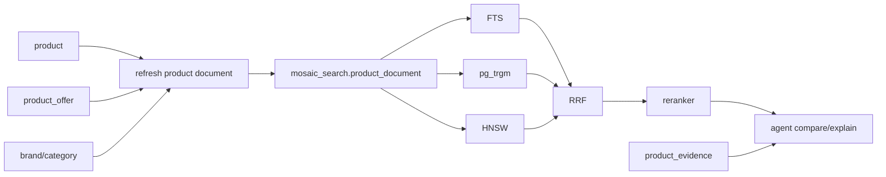

# Data architecture

## Design principles

### Separate truth from retrieval projection

The normalized `mosaic` schema is the product system of record. The `mosaic_search.product_document` table is a deliberately denormalized search projection. It copies the fields needed by FTS, trigram, HNSW, filtering, scoring, and response rendering.

This avoids hiding the PostgreSQL lesson behind a forest of joins while preserving a production-oriented source model.

### Keep hard constraints deterministic

Price, inventory, compatibility, dimensions, availability, and decisive booleans remain typed SQL/JSONB filters. The embedding does not encode current price or stock state. The reranker can express preference, but it must not repair an invalid hard constraint after retrieval.

### Keep candidate provenance

FTS, `pg_trgm`, and vector retrieval emit independent ranks and scores. RRF combines ordinal evidence while retaining source-level provenance for the Retrieval Lab and agent explanation.

### Separate product retrieval from evidence retrieval

`mosaic_search.product_document.embedding` answers which products match. `mosaic.product_evidence.embedding` retrieves the source text that supports claims about those products.

## Logical flow

## Physical design

The projection repeats high-value filter columns on the same table as the vector. This matters for filtered ANN behavior and makes the HNSW lab observable. Core tables remain normalized for maintainability.

At 500K rows, keep the initial design unpartitioned so attendees can see PostgreSQL planner behavior directly. Partitioning or partial HNSW indexes are advanced extensions when filter cardinality and tenant boundaries justify them.
