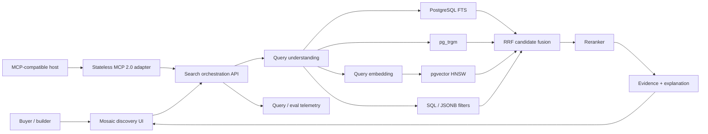
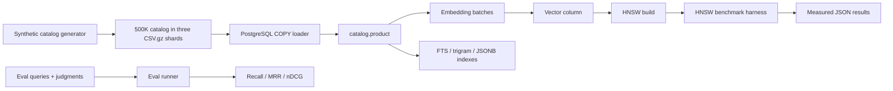

# Reference architecture

## Runtime flow

## Data plane

Aurora PostgreSQL holds:

- canonical product and inventory metadata
- weighted FTS document
- trigram-normalized text
- structured JSONB attributes
- product embeddings
- HNSW index
- reviews/evidence
- evaluation judgments and query telemetry

The design intentionally demonstrates that relational filters and vector retrieval can participate in one transactionally consistent data plane.

## Agent and interoperability plane

Strands Agents calls the read-only product tools in-process. The MCP
`2026-07-28` service runs in an isolated dependency environment and calls the
same typed FastAPI routes over HTTP. Neither adapter owns retrieval logic:
filters, candidate generation, weighted RRF, reranking provenance, and
retrieval-run persistence remain behind the API in Aurora PostgreSQL.

## Offline pipeline

## Separation of responsibilities

| Concern | Owner |
|---|---|
| exact words and identifiers | PostgreSQL FTS / B-tree |
| typo and near-string recovery | `pg_trgm` |
| intent and paraphrase | embedding + pgvector |
| hard product eligibility | SQL columns / JSONB |
| heterogeneous rank combination | RRF |
| nuanced final ordering | reranker |
| trust and auditability | evidence + component diagnostics |
| performance truth | measured harness and preserved run metadata |
