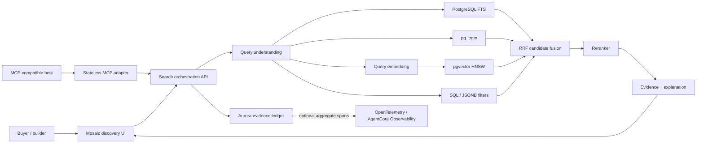
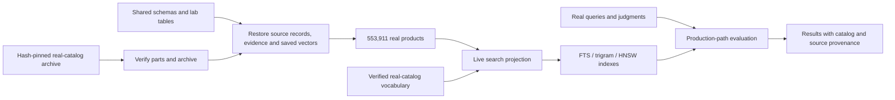

# Reference architecture

## Runtime flow

## Data plane

Aurora PostgreSQL holds:

- real source-product metadata (without invented current price or stock)
- weighted FTS document
- trigram-normalized text
- structured JSONB attributes
- product embeddings
- HNSW index
- reviews/evidence
- evaluation judgments and query telemetry

The design intentionally demonstrates that relational filters and vector retrieval can participate in one transactionally consistent data plane.

Engine and extension version facts for the cluster this runs on, and the
version claims it declines to make, are in
[`postgres-18.md`](postgres-18.md).

## Agent and interoperability plane

Strands Agents calls the read-only product tools in-process. The MCP
`2026-07-28` service runs in an isolated dependency environment and calls the
same typed FastAPI routes over HTTP. Neither adapter owns retrieval logic:
filters, candidate generation, unweighted RRF, optional weighted comparison,
reranking provenance, and
retrieval-run persistence remain behind the API in Aurora PostgreSQL.

## Catalog restore and measurement

Bootstrap restores the saved Cohere vectors; it does not generate products or
re-embed the catalog. [ARTIFACTS.md](../ARTIFACTS.md) describes the pinned bundle
and Aurora-only restore. Historical generators and CSV shards remain for
regression tests and are excluded from fresh workshops. Historical scorecards
and scale benchmarks cannot certify this catalog; current-catalog measurements
must carry matching provenance.

## Separation of responsibilities

| Concern | Owner |
|---|---|
| retrieval truth: candidates, eligibility, indexes, fusion, provenance, evidence | Aurora PostgreSQL |
| model intelligence: embeddings, reranking, orchestration, synthesis | Amazon Bedrock models |
| execution and citation authority | application controller |
| optional managed runtime, transport, and tool exposure | Amazon Bedrock AgentCore |
| performance truth | measured harness and preserved run metadata |

AgentCore can change where the Strands loop runs or how a host reaches tools. It
does not become the retrieval authority. A Gateway in front of the MCP tools
authenticates callers and publishes typed schemas; it does not authorize
evidence, which stays with `service/retrieval_scope.py` and the application's
per-turn citation state. See
[`mcp-interoperability.md`](mcp-interoperability.md). No AgentCore resource is
required or deployed by the workshop. The optional observability adapter
exports an aggregate projection while Aurora retains the complete replayable
Retrieve → Rank → Reason contract; see
[`telemetry-contract.md`](telemetry-contract.md).
