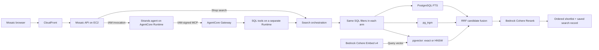
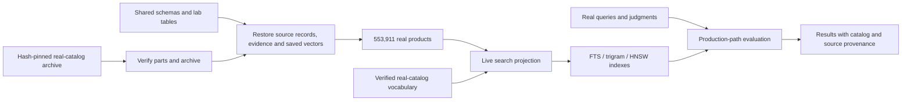

# Reference architecture

## Search and agent paths

```mermaid
flowchart LR
    UI[Mosaic browser] --> CF[CloudFront]
    CF --> API[Mosaic API on EC2]
    API -->|Shop search| SEARCH[Search orchestration]
    API -->|IAM invocation| AGENT[Strands agent on AgentCore Runtime]
    AGENT -->|IAM-signed MCP| GW[AgentCore Gateway]
    GW --> TOOLS[SQL tools on a separate Runtime]
    TOOLS --> SEARCH
    SEARCH --> FILTER[Same SQL filters in each arm]
    FILTER --> FTS[PostgreSQL FTS]
    FILTER --> TRI[pg_trgm]
    FILTER --> VEC[pgvector: exact or HNSW]
    EMB[Bedrock Cohere Embed v4] -->|Query vector| VEC
    FTS --> FUSE[RRF candidate fusion]
    TRI --> FUSE
    VEC --> FUSE
    FUSE --> RR[Bedrock Cohere Rerank]
    RR --> RESULTS[Ordered shortlist + saved search record]
```

The required workshop deploys Runtime and Gateway. Shop calls retrieval through
the EC2 API; Ask Mosaic invokes the managed agent, which reaches the same SQL
capabilities through Gateway. The API and tools coordinate Bedrock calls;
Aurora executes filtering, candidate retrieval and rank fusion.

## Data plane

Aurora PostgreSQL holds:

- real source-product metadata (without invented current price or stock)
- weighted FTS document
- trigram-normalized text
- structured JSONB attributes
- product embeddings
- HNSW index
- reviews/evidence
- evaluation judgments and query telemetry

The design intentionally demonstrates that relational filters and vector retrieval can participate in one transactionally consistent data plane.

Engine and extension version facts for the cluster this runs on, and the
version claims it declines to make, are in
[`postgres-18.md`](postgres-18.md).

## Agent and interoperability plane

Strands calls supplied tool adapters that send IAM-signed MCP requests to
AgentCore Gateway. Gateway forwards them to the tools Runtime. Both runtimes
have VPC access to Aurora and read database credentials from Secrets Manager.
The browser receives neither AWS credentials nor database credentials.

Neither the agent framework nor Gateway owns retrieval logic:
filters, candidate generation, unweighted RRF, optional weighted comparison,
reranking provenance and retrieval-run persistence stay in the shared
application code and Aurora. Bedrock provides the query embedding, product
reranking, agent and synthesis models. For imported reviews without vectors,
the evidence tool reranks lexical matches against the evidence question before
returning a bounded selection. Citation checks still need to establish that
each selected record supports the claim.

Bootstrap and `make deploy-agent` publish an ARM64 image to the event's
immutable ECR repository. Both runtimes use that image, with distinct agent and
MCP entry points. The hash-pinned catalog is a separate Workshop Studio S3 asset;
runtime packaging creates no S3 buckets. See [managed deployment](agentcore-runtime.md).

## Catalog restore and measurement

```mermaid
flowchart LR
    A[Hash-pinned real-catalog archive] --> VERIFY[Verify parts and archive]
    SCHEMA[Shared schemas and lab tables] --> RESTORE[Restore source records, evidence and saved vectors]
    VERIFY --> RESTORE
    RESTORE --> P[553,911 real products]
    P --> V[Live search projection]
    V --> I[FTS / trigram / HNSW indexes]
    VOCAB[Verified real-catalog vocabulary] --> V
    Q[Real queries and judgments] --> RUN[Production-path evaluation]
    I --> RUN
    RUN --> M[Results with catalog and source provenance]
```

Bootstrap restores the saved Cohere vectors; it does not generate products or
re-embed the catalog. [ARTIFACTS.md](../ARTIFACTS.md) describes the pinned bundle
and Aurora-only restore. Historical generators and CSV shards remain for
regression tests and are excluded from fresh workshops. Historical scorecards
and scale benchmarks cannot certify this catalog; current-catalog measurements
must carry matching provenance.

## Separation of responsibilities

| Concern | Owner |
|---|---|
| retrieval truth: candidates, eligibility, indexes, fusion, provenance, evidence | Aurora PostgreSQL |
| model intelligence: embeddings, reranking, orchestration, synthesis | Amazon Bedrock models |
| execution and citation authority | application controller |
| managed agent execution and MCP tool exposure | AgentCore Runtime and Gateway |
| optional conversation context | AgentCore Memory |
| performance truth | measured harness and preserved run metadata |

AgentCore hosts the Strands loop and connects it to tools; it does not become
the retrieval authority. Gateway in front of the MCP tools
authenticates callers and publishes typed schemas; it does not authorize
evidence, which stays with `service/retrieval_scope.py` and the application's
per-turn citation state. See
[`mcp-interoperability.md`](mcp-interoperability.md). Memory is provisioned but
optional for participants, after the required session. A recalled preference is
context, never evidence of a product fact. The optional observability adapter
exports an aggregate projection while Aurora retains the complete replayable
Retrieve → Rank → Reason contract; see
[`telemetry-contract.md`](telemetry-contract.md).
